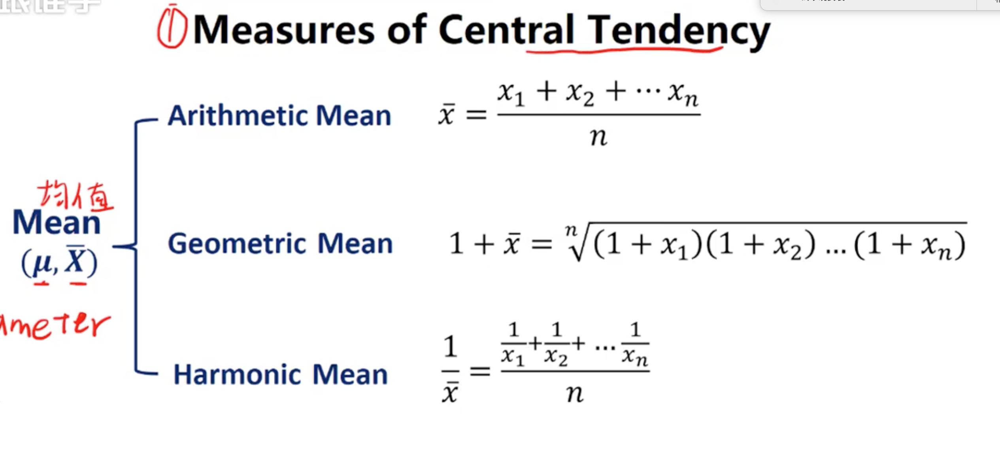
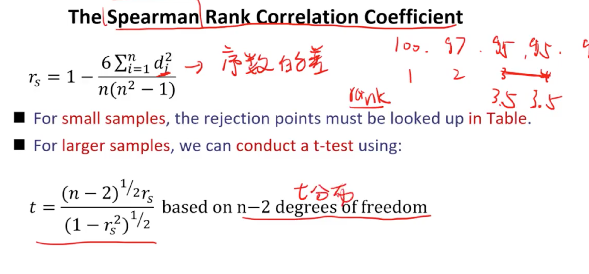

# 数量分析

## 货币的时间价值

### 货币的时间价值，利率，利率的组成部分

#### 货币的时间价值
1. 今天的1块钱 > 明天的一块钱
2. 时间价值体现在储蓄或者投资


#### 利率(r)
1. 最低回报率
2. 折现率
3. 机会成本：选择时放弃的部分

名义无风险利率（短期国债） = 真实无风险利率+预期通货膨胀率
风险溢价 = 违约风险+流动性风险+期限风险

投资利率 = 名义无风险利率+风险溢价

### 复利和折现
1. 现值（pv） 终值（FV）fv = pv * (1 + r)^n
2. 连续复利（每分每秒都在复利） fv = pv*e^(rn)

### 名义利率和有效利率（EAR）
有效利率：每年付利一次的利率 1+ EAR = (1+r/m)^m (m 表示一年复利几次)
连续利率: EAR = e^r - 1

### 年金的现值和终值
1. 普通年金（现金流期末发生）

	```
	FV = PMT * （1 + (1+r) +...+ (1+r)^(n-1)）
	   = PMT * ((1+r)^n - 1)/r 
		PMT 指每年的现金流
	pv = PMT * （1 - 1/(1+r)^n）/r
	```

2. 预付年金（现金流期初发生）

	```
	pv (预付年金) = PV（普通年金） * （1+r）
	
	fv (预付年金) = fv（普通年金） * （1+r）
	```

3. 永续年金 （无结束期限） pv = PMT/r

4. 延迟年金（一段时间之后再开始产生现金流）


## 统计学

### 描述统计学
1. 基础概念
	1. 总体，总体的参数（平均值等）
	2. 样本，需要体现出所代表的总体
	3. 度量尺度
	
	```
		弱： 名义尺度：数据仅仅进行分类，但是不进行排序
			 排序尺度：数据不仅仅分类，还进行了排序，可以用<>号表示关系
			 区间尺度：数据可以用加减法表示关系，没有绝对0点
		强： 比例尺度：数据可以用<>+-*/表示关系
	```


    4. 频率分布
    	* 绝对数值频率
    	* 相对频率：占比，加和为1
    	* 区间之间不能重合
    	* 区间的个数少一些比较好
    	* 累积频率：小于当前区间上边界的频率之和
			 

2. 4个描述维度
	1. 中心点
		* 均值（u,x）
			*  
			* 算术平均值 = 数据之和/个数
			* 几何平均数, 计算投资的年化收益，设置止损线，因为下跌越多，后期需要上涨的幅度越大（非线性放大）
			* 调和平均数，主要用于股票或基金的定投,计算平均成本
			* 大小关系，算术平均数 > 几何平均数 > 调和平均数
			* 加权平均数：计算组合的整体收益率 
		* 中位数（按顺序排序，中间的值，偶数时是中间两个数平均值）
		* 众数，出现数字最多的数，名义数据的均值表示
		* 等分数 数据个数特别多的时候具备统计意义（n+1） *y/100 n 表示数据个数 y表示百分数的值，计算出来的结果表示位置
			* 

	2. 离散程度(波动程度)数据离均值的波动程度
		* 范围： 最大值-最小值
		* 绝对值偏差：  
		* 方差：
		* 标准差：  
		* 半方差：计算小于等于均值部分的方差
		* 目标半方差：选取小于等于某个值的部分的方差
		* 切比雪夫不等式：数据总是在中心周围聚集
			* 偏离标准差两倍标准差的人数最多25%
			*  (k表示离标准差的倍数， k > 1)
		* 变异系数：表示每单位收益的风险 ，越小越好
			
	3. 对称性
		* 偏度，
			* 对称分布的数据，偏度为0，平均值=中位数=众数
			* 偏度大于0，右偏（极大值变多，可能出现超额收益），众数<中位数<平均值
			* 偏度 < 0, 左偏（极小值变多，可能出现极大亏损），平均值 < 中位数 < 众数
			* 
			* 样本数量大于100，偏度<-0.5 或者 > +0.5 都是一个过大的表现
	4. 峰度，描述极大极小值出现的概率
		* 正太分布的偏度=0，峰度 = 3
		* 峰度 > 3, 极值出现的可能更大，形状高峰厚尾巴
		* 峰度 < 3，矮峰薄尾
## 概率论
#### 基本概念
1. 加法法则
2. 乘法法则
3. 互斥事件
	* 
4. 独立事件
	* 
5. 全概率法则 

#### 协方差 和 相关系数（组合的相关性）
1. 方差
	* 
2. 协方差，表示两个变量步调一致的程度
	* 
	* >0 正相关
	* <0 负相关
3. 相关系数 
4. 整体组合的方差 
5. 贝叶斯公式
#### 期望值
* 权重*预期之和

#### 计数
* 

## 常见的概率分布
#### 基本概念
1. 表示所有变量的概率输出结果
2. 离散概率分布
3. 连续概率分布
4. 概率函数	
	* 连续概率函数，表示概率密度，积分才是所取的概率
5. 累积分布函数，小于某个值的概率之和

#### 常见概率分布
1. 离散均匀分布。例如骰子
2. 二项分布，硬币
3. 连续均匀分布
4. 连续分段分布
5. 正态分布，多次二次分布的结果
	* 正态分布标准化
	* 正态分布的规律
	* 亏空风险和安全第一比率
6. 对数正态分布 

 ## 推断性统计学
 
 #### 抽样
 
 1. 简单抽样法 -- 完全随机，个体被抽到的概率相同
 		* 样本容量
 		* 抽样分布 -- 样本的概率分布
 		* 抽样误差 -- 减少误差的方法 --- 提高样本容量 
 	
 2. 分层抽样法
 		* 分层按比例抽样
 
 3. 数据
 		* 时间序列数据
 		* 跨行业的数据
 4. 中心极限定律
 		* 样本容量足够大(n>30)时，样本满足，均值等于总体的均值，方差等于总体方差/n的正态分布
 5. 标准误差
 
 
 6. 好的估计量的标准
 		* 无偏 --- 均值等于总体均值
 		* 有效 --- 拥有最小方差
 		* 持续 --- 样本容量变大，会更接近总体参数
 
 #### 估计
 
 * 点估计法：样本均值 看做等于总体均值
 * 置信区间估计法：样本符合正态分布，通过计算在90%，95%概率的区间范围来计算均值所处的区间范围
 
 #### 学生t分布
 * 样本容量比较小 （n <= 30），不知道方差，如果总体是符合正态分布的，可以认为样本符合学生t分布

 #### 抽样的错误
 * 把偶然当做必然
 		* 重复验证，用样本的数据来验证数据
 		* 没有逻辑
 		* 消除方法：拿样本之外的数据来验证数据
 * 幸存者偏差
 * 过于前瞻 --- 还没有公布的数据进行取样
 * 时间段获取偏差 --- 分析的时间段可能有突发事件等，导致数据不准确


## 假设检验
* 检验样本对整体的估计是否准确

#### 怎么做假设检验
1. 设立原假设（H0）和备择假设(Ha)(和原假设完全相反)
	* 原假设是希望推翻的假设
	* 原假设一般包含相等的情况
	
2. 检验统计量
	* 经过标准化的样本的统计量
3. 双尾检验和单尾检验
	* 双尾检验 表示 原假设不具备方向性，即是== 或 ！=的关系
	* 显著水平---能接受的判断错误的概率（一般1%，5%，10%）
	* 单尾检验
	* 关键值
4. 一类错误和二类错误
	* 一类错误---错误的接受原假设（冤枉好人）
	* 二类错误---错误的拒绝原假设（放过坏人）

5. p值比较法（本质和关键值一个原理）

#### 不同样本统计量的假设检验
* 均值
	* 学生t分布
	* 标准正态分布
	* 检验两个均值的差值，差值与0对比
		* 正态分布，不知道方差
		* 不独立事件，则样本成对相减，求相减后的平均值
		* 独立的事件，可以假设方差相等的话	
* 标准差
	* 卡方分布，非对称，右偏
	* F分布，比较两种方差是否相等
	* 学生t分布
* 相关系数检验
* 非参数检验（不符合正态分布的数据的检验）
	* 数据有序
	* 数据不确定是什么分布
	* 数据检验的不是均值，标准差等
	* 
 