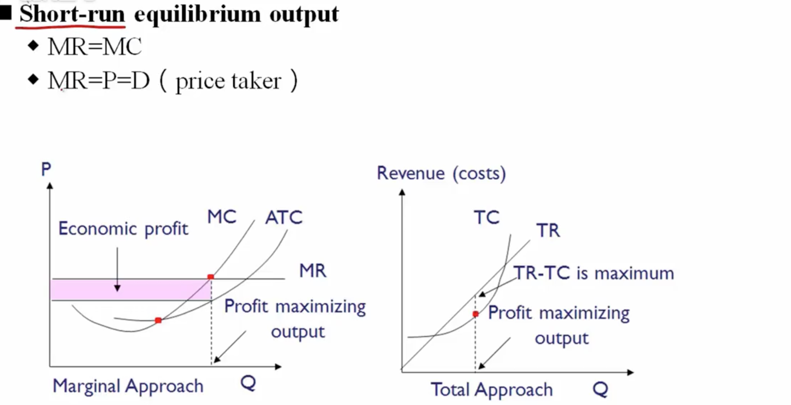
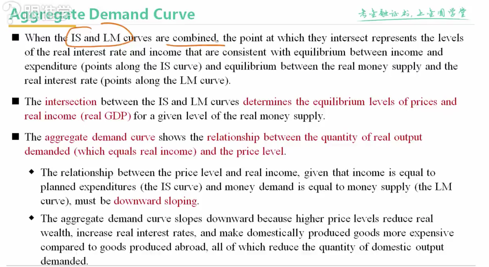
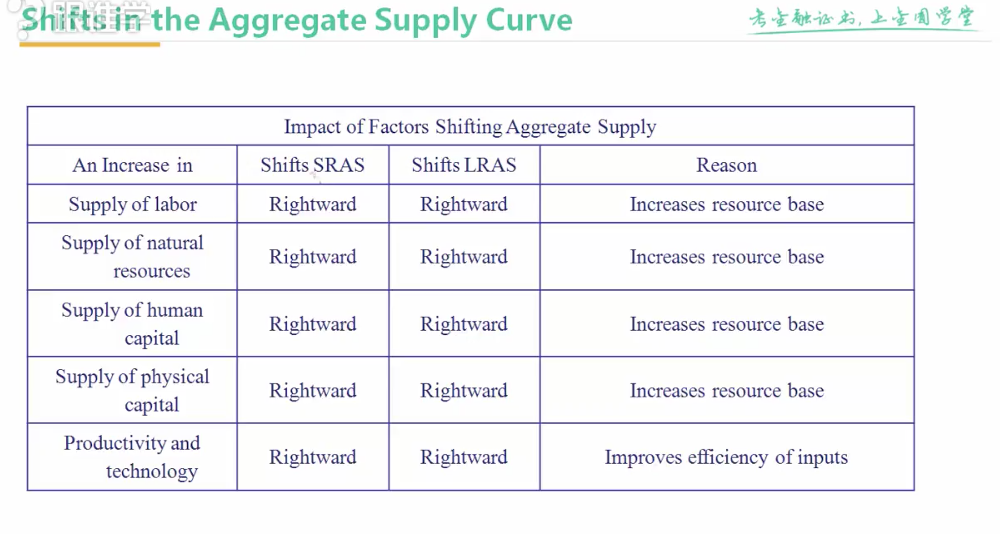

## 经济学

### 需求和供给的关系
* 需求的弹性
	* 价格弹性 ==> 价格变动时，需求变动的幅度
		* 弧弹性--> 非连续，有间断的变动 
		* 点弹性 --> 连续变动 
		* 总收益 = 价格 * 需求数量，通过计算弹性，可以描述何时总收益最大，缺乏弹性时，价格下降，总收益变低，有弹性时价格下降，总收益上升，单位弹性（弹性 = 1）时，总收益最高
	* 替代品的可得性，存在替代品时价格上升，可能需求下降更快
	* 价格和总花费的占比，如果占比很小，需求可能变化不大
	* 时间的长度，时间越长弹性越大
	* 交叉弹性
		* 替代品或者互补品，价格变动对自身商品需求的变化
	* 收入弹性
		* 消费者收入变动对需求的变化
		* 次级物品 --> 收入的增长，需求下降，收入弹性小于0
			* 基芬物品 —> 收入效应大于替代效应（价格下降时需求下降）（只考虑下降的场景） 
		* 正常物品 --> 收入上涨时需求变高,奢侈品弹性较大，一般大于1，必须品弹性较小，一般在0~1之间
			* 韦博伦商品（只考虑价格上升的场景） -> 奢侈品 -> 价格越高，价值越高，消费者越认可
* 替代效应
* 收入效应   

* 生产要素
	* 土地
	* 劳动力
	* 资本物品（其他产成品）
	* 原材料
	* 主要
		* 资本
		* 劳动力 

* 边际收益递减
	* 总产量
	* 平均产出
	* 边际产量 --> 每增加一单位产量，总产量的增加值
	* 
* 投入的成本变化
	* 总成本
	* 总可变成本
	* 总固定成本
	* 平均可变成本 --> 先下降后上升
	* 边际成本 --> 先下降后上升
	* 平均固定成本 --> 不断下降
	* 
* 收益的分析
	* 总收益
	* 平均收益
	* 边际收益 
	* 完全竞争的市场，价格又市场决定，不随产量变动而变动

* 利润最大化
	* 
* 不亏不赚时
	* 价格=平均总成本  

* 停产的条件
	* 价格小于平均可变成本
* 规模的经济 和 规模的不经济（成本都是先降后升）
	* 规模的经济  
		* 有一些成品的生产必须达到一定的规模才有收益
		* 专业分工 
		* 基础设备，先进设备
		* 规模大了降低消耗和浪费，副产品等
		* 获取信息越充分，管理越有效
		* 采购成本降低
	* 规模的不经济
		* 产业递减
		* 管理成本变大
		* 职能的交叉和重复
		* 原材料有限可能导致采购价格更高
### 市场和企业的结构
* 决定企业市场结构的要素
	* 企业数量和占比
	* 产品的差异性
	* 企业定价权
	* 进入或退出市场的难度大小
	* 非价格竞争手段
* 经济利润 = 总收益 - 总成本（成本包括机会成本） 
* 完全竞争 （农产品）
	* 生产者和消费者数量多
	* 产品无差异
	* 进入或退出的壁垒很低
	* 生产产商对价格无议价权
	* 无非价格竞争手段
	* 产生的原因
		* 单一产商的市场占有量低
		* 消费者市场透明度高
	* 价格越高，产量越高 
	* 消费者剩余---边际效用递减 
	* 长期无经济利润，只有会计学利润
		* 
	* 完全竞争短期收益 
		* 
* 垄断竞争
	* 大量生产者
		* 单一企业占比低
		* 对价格无议价权
		* 企业间无法互相勾结
	* 每个产品有差异化（主要特征）
	* 产品的价格和质量不完全一致，可以通过质量，价格，推广进行竞争
	* 进入门槛低，退出容易
	* 需求曲线右下，弹性大
	* 
	* 垄断供应价格曲线
		* 
	* 长期经济利润为0
		* 产量低于理想产量
		* 成本高于完全竞争（差异化导致的，例如广告等）
		* 价格比完全竞争高 
		*  
* 寡头
	* 生产厂商少，之间相互依赖
	* 进入壁垒高
	* 产品可能相似也可能不同
	* 描述寡头市场四种模型
		* 
		*  
		* 
		* 
* 完全垄断
	* 只有一个产商
	* 无替代品
	* 进入成本非常高
	* 定价权非常高
	* 通过广告等方式建立差异化
	* 产生原因
		* 专利或者版权
		* 控制某一类型的资源
		* 政府授权
		* 打造了成功的品牌
		* 新技术
	* 完全垄断的供应关系
		* 
		* 
	* 长期效应
	* 价格歧视（卖个不同消费者时，价格不同）
		* 1类是针对不同消费者
		* 2类是基于销售数量（质量），定价格
		* 3类对不同人群进行划分
		* 价格歧视发挥作用的情况
			* 面临的需求曲线是往右下方倾斜的
			* 消费者人群能根据特征分组，且价格弹性不一样
			* 分组的消费者之间不能买卖商品
		* 作用
			* 降低无谓的损失
	 * 政府干预手段
	 	* 设置价格为边际成本，给予补贴
	 	* 国有企业
	 	* 政府机构授权监管
	 	* 竞标
* 测量行业的集中度
	* 把排名靠前的企业相加计算占比，估算集中度
	* 把排名靠前的企业的占比平方相加，在1000%以下是完全竞争，在1800以下是垄断竞争，在10000以下是寡头，10000以上是完全垄断
		* 局限性：无法反应行业进入的门槛高低，集中度的变化的趋势无法衡量
* 

### 总产出，价格和经济的增长
* GDP -- 市场价值的衡量，对最终产成品的衡量，在某个地区或国家之内，限定时间
	* GDP包括的 
		* 衡量最新生产的
		* 衡量最终的产成品
		* 产品或者服务由政府提供，计算政府提供的成本
		* 自住的房子是按租金计算
	* 不包括的
		* 上期生产的
		* 政府提供的转移支付（社会福利支出等）
		* 没有进入市场的劳动
		* 生产中的副产品
		* 中间物品
		* 易物交易
		* 不纳入GDP的交易
		* 非法交易
* GDP的计算
	* 支出法：为了生产的支出
	* 收入法：生产给整个社会的收入
* 名义GDP
	* 社会最终产出产品的价值，市场价*数量 
* 真实GDP
	* 产量是当年的产量，价格是过去某一时期的价格
* 人均的真实GDP
	* 真实GDP / 总人口
* GDP平减指数
	* 名义GDP/真实GDP
* GDP核算支出法
	* 消费者对最终的产品和服务的支出（c）+ 私人部门的投资（i）+ 政府的支出（G）+ 进出口（出口(x)-进口(M)）
	* 
* GDP核算收入法
	*  
	* 

* 总需求曲线
	* 产品市场曲线（IS） 
	* （其中y表示国民收入）
	* 货币市场曲线（LM曲线）
		* 货币的需求
		* 
	* 总需求曲线
		*  
		* 
	* 
* 总供给曲线 
	*  
	* 
	* 
	* 