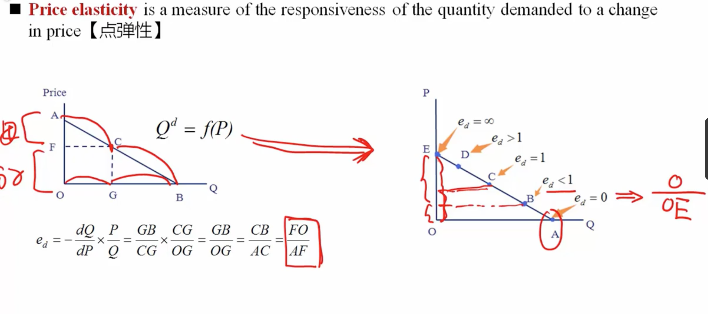

## 经济学

### 需求和供给的关系
* 需求的弹性
	* 价格弹性 ==> 价格变动时，需求变动的幅度
		* 弧弹性--> 非连续，有间断的变动 
		* 点弹性 --> 连续变动 
		* 总收益 = 价格 * 需求数量，通过计算弹性，可以描述何时总收益最大，缺乏弹性时，价格下降，总收益变低，有弹性时价格下降，总收益上升，单位弹性（弹性 = 1）时，总收益最高
	* 替代品的可得性，存在替代品时价格上升，可能需求下降更快
	* 价格和总花费的占比，如果占比很小，需求可能变化不大
	* 时间的长度，时间越长弹性越大
	* 交叉弹性
		* 替代品或者互补品，价格变动对自身商品需求的变化
	* 收入弹性
		* 消费者收入变动对需求的变化
		* 次级物品 --> 收入的增长，需求下降，收入弹性小于0
			* 基芬物品 —> 收入效应大于替代效应（价格下降时需求下降）（只考虑下降的场景） 
		* 正常物品 --> 收入上涨时需求变高,奢侈品弹性较大，一般大于1，必须品弹性较小，一般在0~1之间
			* 韦博伦商品（只考虑价格上升的场景） -> 奢侈品 -> 价格越高，价值越高，消费者越认可
* 替代效应
* 收入效应   

* 生产要素
	* 土地
	* 劳动力
	* 资本物品（其他产成品）
	* 原材料
	* 主要
		* 资本
		* 劳动力 

* 边际收益递减
	* 总产量
	* 平均产出
	* 边际产量 --> 每增加一单位产量，总产量的增加值
	* 
