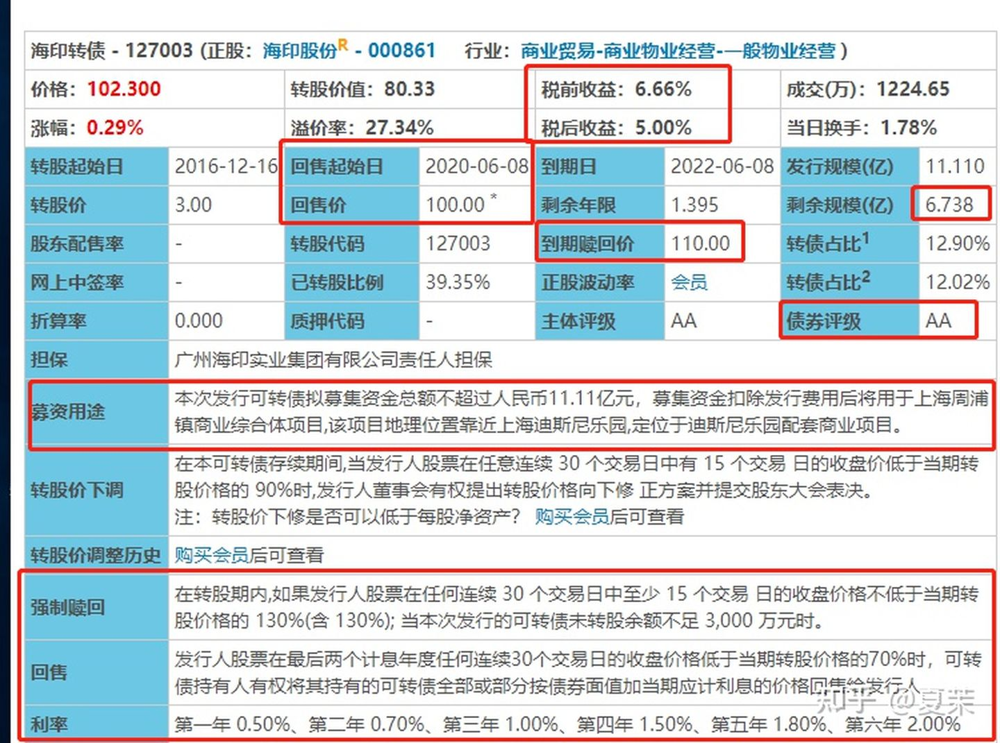
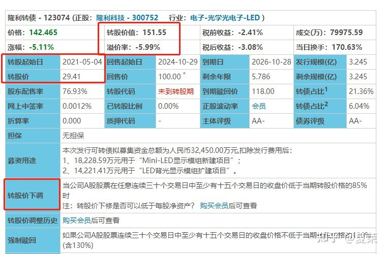

# 可转债介绍
想买可转债，但是数据看不懂咋办？ 今天我们就来一一拆解下可转债的关键指标。

## 债性相关的指标。

### 面值

可转债的面值都是100。面值可以理解为我借了100块给你。为什么市面上会有低于100面值的可转债呢？就比如我借了钱给你，你觉得我还不起钱，要跑路了，然后你就说，我急用，你还九十快也行吧.....

### 价格

价格102.3，它决定着买你可转债的价格。可转债的价格 受什么影响呢？ 首先是正股股价。因为可以按事先规定的价格转换成股票，所以股价涨跌会带动可转债价格的涨跌。其次是转股价。当公司下修转股价时，价格会上涨。

### 债券期限

债券期限就是可转债发行的 年限，可以简单地的理解为一支可转债从发行那天开始最多能再市场上存续多久。转债发行存续时间一般是5~6年。与其相关的是剩余年限，即代表可转债还有多久到期。

### 发行规模

可转债具体发行了多少，就是该可转债的发行规模 。 与之对应的是剩余规模。

### 剩余规模

我们说过，可转债是可以转股的，当投资者把可转债转股之后，可转债的规模就会变小，这就是剩余规模。即市场上还剩下多少可转债。那剩余规模对我们有啥用呢？剩余规模越小的转债，越容易被大资产炒作，越易暴涨暴跌。并且越小代表可转债可能退市，比如该可转债的强赎条件就有规模小于3000千万。

### 到期赎回价

到期赎回价即可转债到达退市时间后，赎回的价格是多少。

### 债券利率

债券期限是最多存续的年限，那可转债会不会提前退出市场呢？这点就是可转债和其他债券不一样的地方，可转债完全可能由于种种原因会提前退出市场，如回售，强赎。那提前退出市场利率咋算？利息咋算？每年偿还的利息的多少，就是该可转债的债券利率了。如海印可转债得了利率为：第一年 0.50%、第二年 0.70%、第三年 1.00%、第四年 1.50%、第五年 1.80%、第六年 2.00%。

### 评级

可转债的评级由低到高为 A- A A+ AA- AA+ AAA， 评级越高，转债越不容易违约。像亚药可转债的评级为A-， 评级为A-的一般为问题债，有违约的可能。评级并非一直不变的，当公司出现问题时，还款能力改变时，评级也会修改。

### 到期收益率

即持有到期收益率是多少。是可转债作为债券最重要的指标。也是衡量可转债安全边际的指标。它告诉我们可转债持有人最差的情况是什么 。比如该可转债的税前收益为6.66%，代表持有带去收益为6.66%，如果是-6.66%，那就代表最差亏6.66%。当可转债的到期收益率达到了当期货币型基金的平均收益时，它才具有债性。因为个人投资者到期兑付的时候，需要交税，所以具体有税后、税前收益率。

接下来我们的重量级条款----回售要登场了。

### 回售

回售条款一般分为两种：有条件回售和附加回售

* 有条件回售即持有人可以在特定条件下，将手中持有的可转债以特定的价格卖回给发行可转债的上市公司，上市公司无权拒绝此项交易。那特定条件是啥呢？ 就是要在回售起始日内，并达到回售条件，以特定的价格（回售价）。 比如海印可转债的回售起始日为2020-06-08；回售价为100；回售条款为：发行人股票在最后两个计息年度任何连续30个交易日的收盘价格低于当期转股价格的70%时，可转债持有人有权将其持有的可转债全部或部分按债券面值加当期应计利息的价格回售给发行人。

* 何为附加回售呢? 上市公司发行可转债时，需要写明募集用途。如果公司募集资金的用途发生了重大改变，投资者是有权进行回售的。如该转债的募资用途为：本次发行可转债拟募集资金总额不超过人民币11.11亿元，募集资金扣除发行费用后将用于上海周浦镇商业综合体项目,该项目地理位置靠近上海迪斯尼乐园,定位于迪斯尼乐园配套商业项目。如果公司拿可转债去炒股了，我们就可以要求回售咯。

所以大家清楚为啥会有回售了吧？ 因为怕发行公司乱花钱，因为怕公司盈利不好，股价节节下跌呀。所以回售条款其实是对投资者的保护，也是可转债下有保底的原因之一。

## 股性

海印转债赎回价110，存续期限五六年。好像收益率不高啊.... 买不如直接买债券收益率高啊，我为啥要瞎折腾呢？其实我们大部分投资者，买可转债的目的，都不是看中它的债性，而是其背后的看涨期权。好了，接下来我们以隆利转债为例来讲讲可转债的股性。

### 转股价

所谓的转股价，就是事先规定好的，按什么价格去转换股票，这个价格就是转股价。该可转债转股价为29.41, 代表如果转股的话，转股时的股价为29.41， 而其对应正股隆利科技的股价为44.57,等于打折买股票。

### 转股起始日

可转债并不是发行了就可以转股的，过了转股起始日之后，便进入转股期。一般建议购买进入转股期的可转债，进入转股期的可转债交易会活跃一些，公司促进转股的意愿也更高。

### 转股价值

转股价值151.55 是指每张可转债转换成正股并卖出可以得到的金额，其单位为元。计算公式为转股价值=正股价值*100/转股价格。

它有哪些作用呢？

① 可转债发行时判断其是否具有申购价值和配售价值。一般来说，如果高于100 则具备申购价值和配售价值。具体考量时，还要参考正股质地 转债评级 现存可转债的折溢价率等多个因素。

② 判断是否达到强赎 回售标准 如强赎条件;如果公司A股股票连续三十个交易日中至少有十五个交易日的收盘价不低于当期转股价格的130%(含 130%) 可以理解为30个交易日中至少有15个交易日转债转股价值不低于130元

③ 测算溢价率

### 溢价率

溢价率是指可转债市场成交价格相对于其转股价值高出的百分比。溢价率越低，可转债价格和对应股票价格的相关性就越强，反之，则越弱。一般情况，溢价率超过20%，可转债的股性就比较弱了,该可转债的溢价率为-5.99%，股性相对来说比较强。

溢价率=（转债价格/转股价值-1）*100%

低价可转债溢价率高，是因为有债性托底，可转债跌幅远低于正股造成的；高价可转债也有高溢价的情况，它衡量市场对该可转债大的追捧热度溢价率低，代表可转债的股性很强，越容易跟随正股同步涨跌。该可转债的溢价率为-5.11%的原因就是为进入转股期还不能转股的缘故。

### 转股价下调

为什么公司要下修转股价呢？如果遇到了持续的熊市，正股价格长期大幅低于转股价，就会造成买可转债的投资人不愿意转股的情况，基于把债主变股东的动力，上市公司会在募集说明书里提出下调转股价条款，把转股价格调低！有些下跌更严重的即将达到回售条件的公司，也会下修转股价以避免回售。

该可转债的下修条件为：在本可转债存续期间,当发行人股票在任意连续 30 个交易日中有 15 个交易 日的收盘价低于当期转股价格的 90%时,发行人董事会有权提出转股价格向下修 正方案并提交股东大会表决。一般可转债的下修条件为低于到期转股价80%，该可转债为低于85%，其下修条款相对来说比较宽松，对于投资者来说，越宽松越好。

### 强赎

接下来我们讲讲可转债的第二重要条款：强赎，即强制赎回。

强赎是指满足特定条件后，可转债的发行人有权按照特定的价格强制从投资人手里提前赎回已发行的可转债。为啥要强赎呢？这要从可转债发行的原因说起。公司发行可转债的终极目的是为了持有人能转股，这样债主变股东，它就不用还钱了。它的心里想的是，辛辛苦苦凭本事借的钱，为啥要还？（某些财大气粗，不差钱的公司除外，他们可能就想低息借钱。但是不差钱的公司毕竟是少数，历史上90%多的可转债都是强赎退市。）万一持有人不主动转股咋办？ 岂不是要还钱？ 所以强赎条款就出来了。

该可转债的强赎条款为：在转股期内,如果发行人股票在任何连续 30 个交易日中至少 15 个交易 日的收盘价格不低于当期转股价格的 130%(含 130%); 当本次发行的可转债未转股余额不足 3,000 万元时。乍一看他像一个霸王条款，其实不是。因为为了不还钱，公司会想方设法让可转债的价格达到130以上，以触发强赎条件。130以上，这点是上市公司和投资者统一的目标。

需要提醒的一点是，达到强赎条件的公司，都有强赎的风险，如果发生强赎，可转债投资者有三种选择：1 卖出可转债，挣30%以上的收益 2 转股 3 按照强赎价（100 价一点点利息 一般是102左右）。发生强赎时，会有公告，我们需要关注强赎公告，提前卖出或者转股，不然到期就会按照强赎价赎回，这也是可转债投资需要规避的一个风险。

转股价 下修转股价 强赎条件 回售条件 是可转债的四大要素，更佳详细的内容可以参考我的想投资可转债？ 这四大要素必须知道！.

## 可转债的交易特点。

* t+0交易

T指的是交易日，T+0就是说可转债都是当天买当天就可以卖了！

* 无涨跌幅度限制

但是为了减少市场波动、控制风险，设置了停牌机制。沪市可转债停牌机制：当涨跌幅达到20%时停牌30分钟，价格涨跌幅超过30%将停牌至14：57分，停牌期间不能交易。

深市可转债停牌机制：当涨跌幅达到20%时停牌30分钟，价格涨跌幅超过30%停牌30分钟，可转债一旦停牌时间超过14：57会自动复牌，停牌期间不能交易。

* 交易不收印花税

* 交易佣金比股票低

* 沪市可转债交易单位为手（1手=1000元） 深市为10张（1张=100元）

* 沪市交易价格最小单位为0.01元，深市为0.001元
