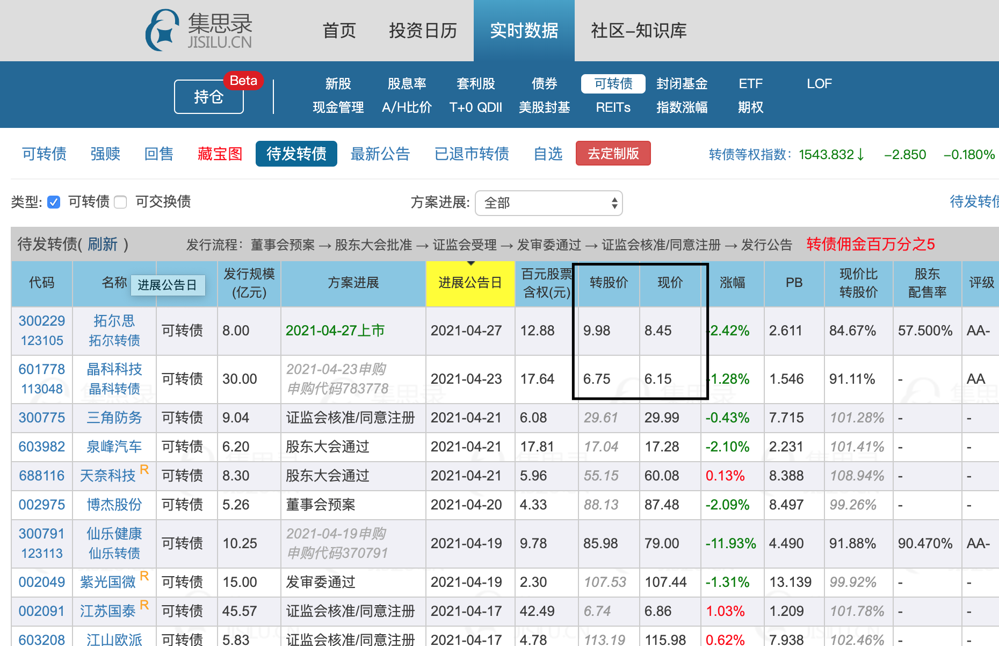
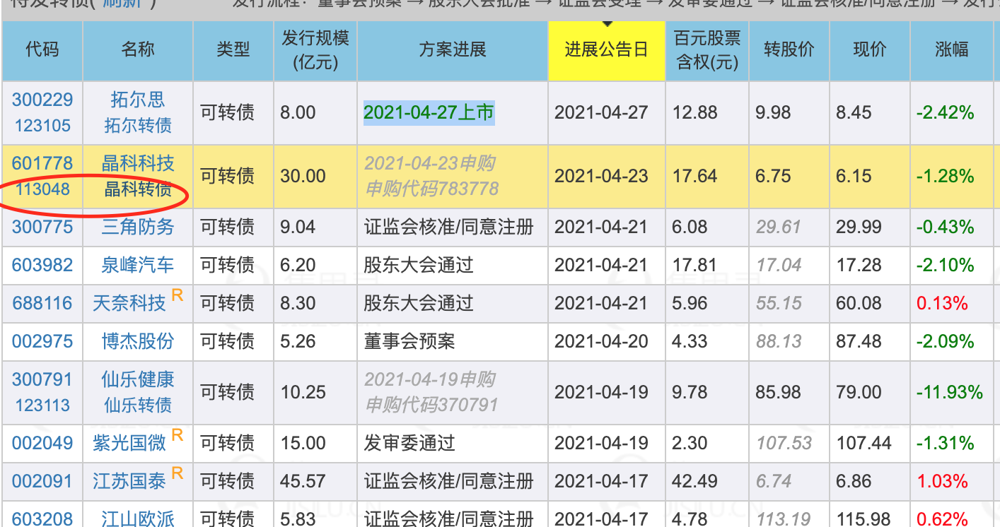
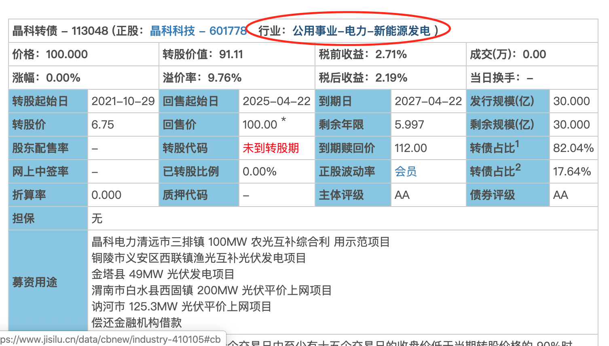
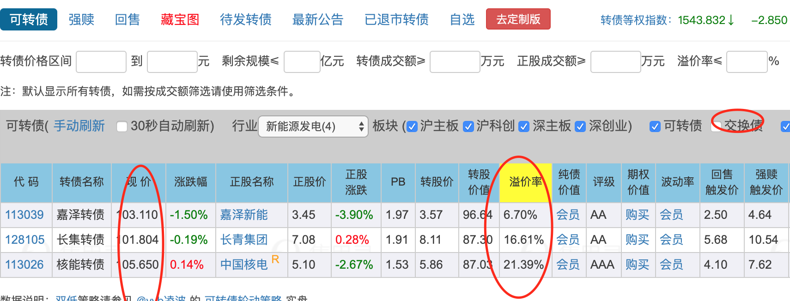

# 如何预估新债上市的价格

* 评级
* 转股股票价格
* 涉及的概念热门程度（可选a）

## 计算方法
* （现价比转股价+评级溢价+概念溢价（可选））* 100

## 具体操作
* [集思录](https://www.jisilu.cn/data/cbnew/#pre) 实时数据-->可转债-->待发转债
* 
* 评级简单估算

| 评级 | 评级溢价 | 
| ------ | ------ |
| AAA | 15% | 
|AA+ 和 AA | 10%|
|AA-|5%|
|A+ | 0%|

* 概念溢价（可选）

* 通过相同行业的其他可转债辅助判断
* 待发转债 ---> 对应可转债 --->  点击所属行业 ---> 去除可交换债 ---> 选择110元以上可转债作为参考