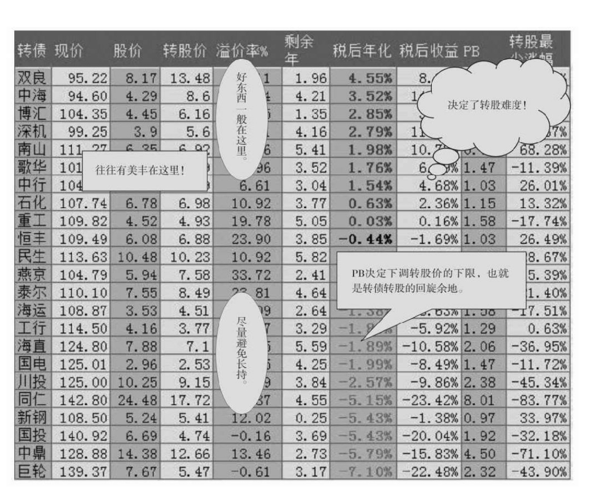
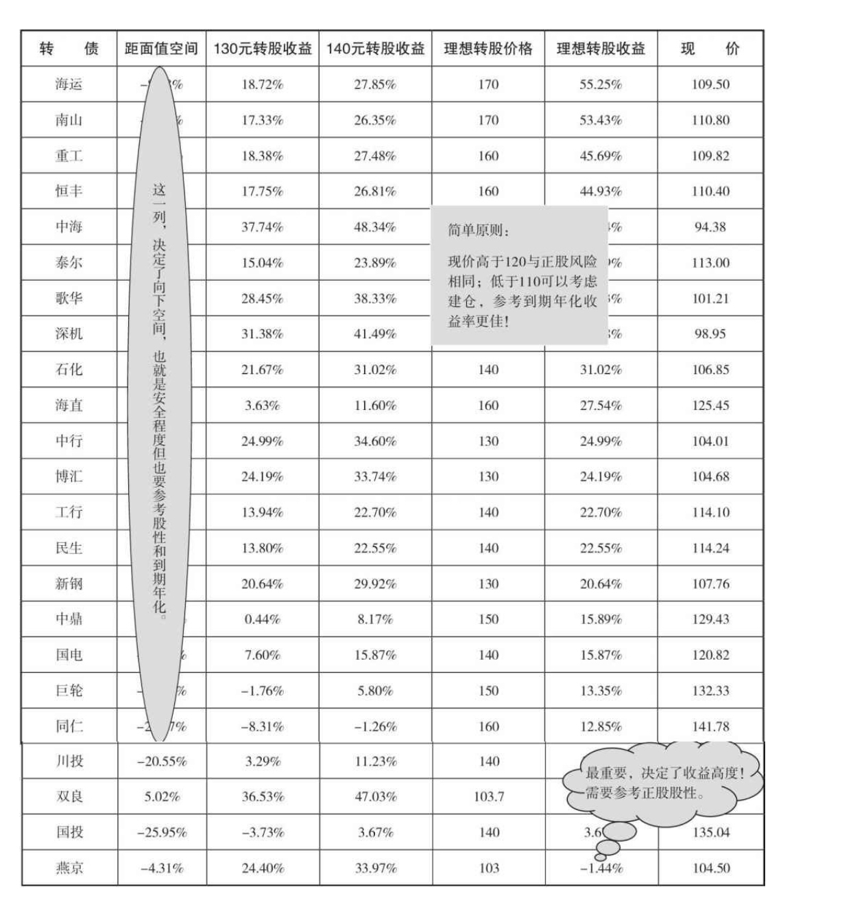
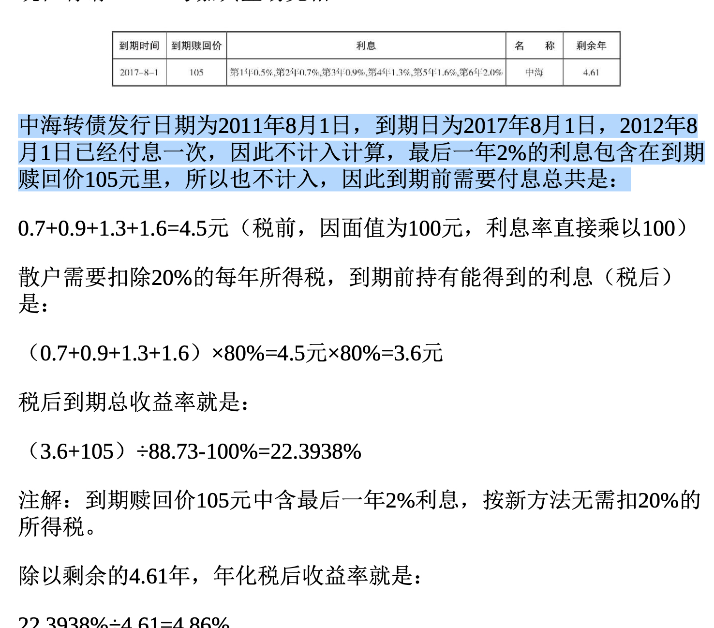

## 可转债投资魔法书

* 前面不少描述可转债相关属性，介绍等和其他没太大区别，又很啰嗦就不记录了

### 第3章第24节 可转债套利
1. 可转债转股套利
	
	>> 	假设某转债转股价2元，转债现价101元，正股价2.1元。此时以101元买 进转债，以2元转股价转股可得50股正股，市价卖出得50×2.1=105元， 去掉交易成本和101元，剩下的就是套利所得。不过，由于当日转股需次日卖出，所以既有时间成本，次日股价也有

2. 回售保护条款套利

	>> 假设某可转债的转股价为10元，其回售保护触发条件为:“如果公司股 票收盘价连续30个交易日低于当期转股价格的70%时，可转债持有人有 权......按面值的103%(含当期计息年度利息)回售给本公司......”，那 么当股价即将触发该条件时，公司为了避免回售的发生，可能会采取种 种措施提振股价。这样，套利的机会就出现了。
假设该可转债正股股价已经连续十几个交易日低于转股价的70%——也 就是7元，而股市整体并没有大熊，公司经营也正常，投资者可以适当 买入，比如6.5元。果然，几天后公司宣布利好，公司股价重新站上7 元，十几天内套利收益达到7.69%以上

3. 强制赎回条款套利

	>> 假设某可转债的转股价为10元，其回售保护触发条件为:“如果本公司 股票在任何连续30个交易日中至少20个交易日的收盘价不低于当期转股 价格的130%，本公司有权按照债券面值的103%......赎回全部或部分未 转股的可转债。”那么当股价即将触发该条件时，公司为了促成强制赎 回的发生，可能会采取种种措施拉抬股价。这时，也可能存在无风险套 利的机会。
假设该可转债正股股价已经连续十几个交易日高于转股价的130%—— 也就是13元，忽然有几天随股市波动跌到12元。但股市整体并没有大 熊，公司经营也正常，这时投资者可以适时买入。果然，几天后公司为 了促进转股，连续宣布利好，公司股价一举冲上14元，成功造成了强制 赎回，十几天内正股套利收益达到16.67%以上

4. 下调转股价条款套利

	>> 此套利需预判上市公司下调转股价，进而提高转债价值，具有一定的不
确定性。

### 第4章 可转债投资三大流派
1. 可转债投资大致分为三派:安全分析派、期权定价派和规则套利派
2. 规则套利派

	>> 1.正股即将满足向下修正转股价条件，提前买入正股等待拉升。
比如，某只可转债的向下修正转股价条件为“连续20天低于转股价的 80%......”，当连续10几天正股股价低于转股价80%时，可以买入部分正 股套利。一般上市公司为了避免触发转股价的下调，会适当拉抬股价。 此时投资者可坐收渔利。
不过，如果股市大跌，或者上市公司无力拉抬股价，依然有亏损的风 险。

	>> 2.正股即将满足回售保护条件，提前买入正股等待拉升。
比如，某只可转债的回售保护条件为“连续20天低于转股价的70% ......”，当连续10几天正股股价低于转股价70%时，可以适量买入部分 正股套利。上市公司为了避免回售的发生，可能面临两个选择:直接拉 抬股价回到转股价的70%或80%以上，或者直接下调转股价。如果选择 的是前者，此时正股投资者可坐收渔利。

	>> 3.正股即将满足强制赎回条件，提前买入正股等待拉升。 
	比如，某只可转债的强制赎回条件为“连续30个交易日中有15个交易日高于转股价的130%......”，当连续10几天正股股价高于转股价130%，忽然短期有一段时间跌下130%，此时可以适当买入部分正股套利。一般 上市公司为了尽快促成转股的最后完成，必然会适量拉抬股价以保持在 转股价的130%以上。此时投资者可坐收渔利。此时介入正股，风险较小，比前两种情况盈利的可能性都要高。

	>> 4.正股即将满足修正向下转股价条件，提前买入可转债等待拉升。
比如，某只可转债的向下修正转股价条件为“连续20天低于转股价的 80%......”，当连续10几天正股股价低于转股价80%时，一般上市公司为 了避免触发转股价的下调，会适当拉抬股价;但是如果股市大跌，或者 上市公司无力拉抬股价，很有可能选择如约下调转股价。此时可转债价 格会应声上涨，可转债投资者可坐收渔利。请注意，下调转股价是公司的权利，而不是义务，所以虽然可能性较 大，毕竟不是100%的，投资者要根据市场、股价和公司具体情况分析 确定。

	>> 5.正股即将满足回售保护条款，提前买入可转债等待拉升。
	如第2种情况所述，某只可转债的回售条件为“连续20天低于转股价的70%......”，当连续10几天正股股价低于转股价70%时，上市公司为了避 免回售，可能面临两个选择:直接拉抬股价回到股价的70%或80%以 上，或者直接下调转股价。如果发生的是后者，判断准确的话，投资者 可提前买入可转债等着“坐轿子”。回售保护时面对的情况比较复杂，上市公司的选择也比较多样，投资者 一定要具体情况具体分析。如即将触发回售时，市场大势较好，上市公 司更可能选择直接拉抬股价，此时适合买入正股套利;如果大市低迷， 公司又没有什么实质利好时，直接下调转股价比较合算，此时买入可转 债套利比较好。

	>> 6.正股即将满足强制赎回条件，提前买入可转债等待拉升。
比如，某只可转债的强制赎回条件为“连续30个交易日中有15个交易日 高于转股价的130%......”，当连续10几天正股股价高于转股价130%，忽 然有一段时间跌下130%，此时既可以买入正股套利，也可以酌情买入可转债套利。一般此时离强制赎回仅仅一步之遥，上市公司为了尽快促成转股的最后 完成，必然会拉抬股价保持在转股价130%以上一段时间。此时利用可 转债套利，虽然风险较小，但是由于有期权特性，可转债价格往往已在 130元以上，基本上失去了保底的特性，所以套利风险和正股相当，收 益也差不多。

	>> 7.可转债价格大跌，直接买入可转债套利。
	有时候由于市场恐惧情绪蔓延，可转债价格会跌到不可思议的地板价。 此时买入可转债，即使持有到期也能100%获得4%以上的收益，如遇股 市回暖更可能有暴利。前面章节提到过，82.7元的南山可转债，持有到期收益达到8%，而实际 收益率最高达到140%，就是一个很好的例证。2011年下半年，由于中 石化可转债2期再融资的超大利空打击，于当年9月27日最低价达到了 85.95元，即使持有到期也能有年化4%的收益率，而实际上不到一个 月，在10月28日时最高价已经达到102.59元，收益率达19.36%，年化收 益率更加高达232.32%!

	>> 8.到期赎回出现的套利情况。可转债到期后，往往以一个到期赎回价直接赎回。
	比如，目前市场上还存在的河北钢铁可转债(原名唐钢可转债)，其到期时间为2012年12月 13日，到期赎回价格为112元，市场价为107元左右。如果持有到期，保 底收益率为一年5%左右;但是假如河北钢铁有决心解决转股问题，那 么可转债价格很有可能在到期之前冲上120元、130元，那么相应的年化 收益率则可以达到15%、25%。
	
	>> 9.其他可能出现的套利情况。
	除了以上所述的常见情况，还有一些比较少见的套利情况也有可能出 现。比如，在回售价以下抢入可转债，然后以回售价回售给上市公司。虽然少见，但是这种情况确实发生过。虽然利润率不高，往往只有一到两个百分点，但是确定性极高，风险极小，不过十几天就能稳稳获利， 年化收益率也是相当可观的。此外，如果上市公司改变资金用途，或者上市公司被其他公司购并(如前面说的河北钢铁和唐钢可转债)等事项，都有可能造成可转债价格的变动，给套利带来良机。

	>> 无论是以上哪种套利，都不是无风险的，只能做到低风险和更低风 险。 投资者一定要结合可转债的具体条款和市场的即时走势，实事求 是地分析，千万不能以个人主观愿望代替上市公司的大脑来进行思考，一定要客观冷静，最好用技术分析来做辅助。
	
	>> 总的来说，安全分析派的风险最小，投资需要的时间较长，其投资方法 最简单;规则套利派的风险适中，基本多为短线操作，需要一定的技术 分析基础即可;期权定价派的风险相对来说较大，操作可以长短结合，需要的专业理论知识较为精深。说到底，这些投资方法只是一种工具，没有最好的，只有最适合自己的，投资人可以根据自己的具体情况选择。
	
### 第5章 最简单的投资：唾手可得的5+3个投资组合

#### 第35节 直接复制可转债指数

1. 中信标普可转债指数的编制规则是:在可转债上市首日即按当日收盘价计入可转债指数，在可转债退市时将其从样本转债中删除;样本权重采用可转债存量计算的权重，并根据上市公司公布的未转股转债数量每季度调整一次权重

2. 天相可转债指数编制规则是: 以沪深两市所有可转换债券的交易价格， 按发行公司公告的实际未转股规模帕氏加权计算[详见](http://www.txsec.com/txzs/)

#### 第37节 王印国分析师和讯可转债公开组合

1. 王印国分析师之所以在可转债投资圈为人熟知，主要 是因为他每周都会定期在国内的著名财经网站——[和讯网](http://www.hexun.com)更新发布自己的专栏，其中有专业的《深沪转换债 券投资价值排名表》和《深沪转换债券投资建议表》，且数年如一日， 风雨无阻，是跟着专业人士学习可转债的一方好天地

2. [可转债虚拟投资组合](http://bond.hexun.com/wyg/index.html)

3. 王印国分析师公布的电子邮件是:wangyinguo@163.com

#### 第38节 最省心的组合:面值——最高价 折扣法

1. 在面值附近买入可转债，越低越好;
2. 不断记录可转债价格的最高点，持有可转债不动;
3. 一旦可转债价格跌破当前最高点的90%，或从最高价跌掉10 元，立即卖出;
4. 重复步骤1的过程，不到面值附近绝对不买

>> 不过，世事无绝对，这个方案也不是可以100%包打天下的。在一些极 端情况下，有可能会造成投资者的提前出局。比如可转债价格涨到190 元，忽然遇到意外下跌到170元，投资者依照规则会卖出，结果之后可 转债又涨到了更高的200元、300元;又或者，可转债价格上了130元 后，回调到117元、119元(或者上了121元后回调到108元、110元)， 投资者卖出后，结果后面出现更高的最高价等。因此有必要进行小小的 修正。
前者，由于有强制赎回条款的时间约束，出现的概率相当小，投资者可 以根据当时市况进行人工判断。即使提前出局了，盈利也往往不菲，可 以不用刻意求全。
后者，可以把卖出的最低门槛限制在135元或者140元，因为一旦正股价超越转股价的130%，可转债的价格往往在这两个价位之上。因此只要 低于这个价格，即坚决持有不卖。(当然，可转债存续期间的最后一年 情况除外。)
有了这个修正条件，整个规则就更加经得起市场锤炼。(其实即使不做 修正，也只是赚得少一点，不仅不会亏损，绝对还是正收益。)

#### 第39节 安道全理财师的自动投资组合(作者)(安道全公众号)
#### 第40节 兴全可转债基金
#### 第41节 兴全合润A基金
#### 第42节 [兴全官网](https://www.xqfunds.com/)

### 第6章 “面值-高价折扣法”的发扬和实践:“三条安全线”
1. 到期安全价、回售价、面值，三个安全价。
	* 到期安全价(又名到期价值)=到期赎回价(含最后1年利息)+除
最后1年外所有未付利息之和×80%。
	* 到期收益率(税后单利)+=到期价值÷当前转债价格-100%
	* 到期年化(年化税后单利)=到期收益率÷剩余年=(到期价值÷当 前转债价格-100%)÷剩余年
2. 年化价格 是用到期安全价和到期时间，反推年化N%对应的年化价 格。

3. 股性强的，波动大的，题材突出的，业绩好的，资质好的，盘子小的， 有潜力的，高PB的(下调转股价空间大)，当前有回售的，转股愿望 大的，溢价合理的，违约可能小的，质押率高的，到期价值高的，分红 率高的等，往往给予较高的三条线。
4. 股性弱的，波动小的，没有题材的，业绩差的，有隐患的，盘子 大的，没前途的，PB远低于1的(转股价下调无空间)，无回售的，转 股无动力的，溢价太高的，有违约可能的，质押率低的，到期价值低 的，分红少的等，往往给予较低的三条线。

* 有的可转债几年始终徘徊在面值以下，时间成本过高，如何避免?怎么办?

	>> 很简单，下调三条线。不是股性差、价格低吗?好办，放严要求，把该可转债的三条线调到更 低，比如调到:面值、年化3%价格、年化5%价格或更高。
如此一来，股性差、价格低的可转债就被新的三条线筛选出去了。想让 我买入?可以，阁下必须给出更好的年化、更低的价格!否则，请我也 不入瓮!

*  有的可转债终其“一生”始终不在面值附近，却往往一飞冲天，如何 捕捉?怎么办?

	>> 很简单，那就上调三条线。 资质好、股性活跃是吧?好办，那就放宽要求，把该可转债三条线调到更高，比如调到:到期安全价以上=年化-3%、回售、面值。(注意: 这意味可承受年化亏损3%的风险。)
但是!我们郑重建议投资者尽量还是在到期安全价以下买可转债，尽管迂腐，尽管机械，但是安全。如果非常看好并透彻了解标的，也建 议尽量控制在年化-1%~-3%之间，不冒险。

* 如何控制买入节奏? 何为买入节奏?就是在什么价位开始建仓、在什么价位可以加仓、在什么价位可以重仓。
	>> 请取出“三条安全买入线”，然后将它们分别命名为安全建仓线、安全加 仓线、安全重仓线。在安全建仓线(第一条安全线)内，开始建仓。 在安全加仓线(第二条安全线)内，陆续加仓。 在安全重仓线(第三条安全线)内，重仓持有。 这就是买入节奏的控制。

* 市场同时有多只可转债，在相近的价格下，选谁不选谁?先选谁后 选谁?

	>> 依然很简单:看谁先满足三条安全线，看谁更满足三条安全线，谁满足 条件更充分(重仓线优于加仓线，加仓线优于建仓线)，或者先到先 得。
不过，这是原则。真正的投资是门艺术，其艺术之处在于:如何定义每 只可转债的三条线?显然，没有完全一样的标准答案(本书答案仅供参 考)。但是，一旦“艺术”地确定了自己的三条线，那么接下来的事情就 简单很多了:照着三条线机械操作即可

* 选中了某只可转债，买多少比例合适?
	>> 简单是原理简单:给每条线设一个持仓比例即可。比 如“3:3:4”或“3:5:2”等。
假设某转债的最高拟持仓仓位是100%，“3:3:4”原则，意味着该转债满 足安全建仓线后，可最多建仓到30%;在满足安全加仓线后，可再加仓 30%~60%;满足重仓线后，可加仓40%~100%为止

* 如何控制单只和多只转债仓位?

	>> 如果是多只转债仓位怎么办?还是依据三条线自定建仓比例，不过再自 定一个单只持仓上限:比如最高单只比例不超过10%、30%或50%等。
假设单只转债持仓最高不超过30%，那么依据三条线操作，先满足的先 买入，一直到单只最高30%为止。如此即使转债多达几十只、价格起落 参差不定，依然能有条不紊从建仓直到满仓。纵然市场“嘈嘈切切错杂 弹”，依然能让转债“大珠小珠落玉盘”。
最高30%的限制，至少要持有4只转债，一般可容纳10只左右，还能有 效分散风险。
该上限也是自定的，对标的不确定的时候，建议上限要低，比如10%; 当对标的很有信心的时候，上限要高，比如50%。一般来说，10%~33% 对初学者比较适用。
一般来说，给所有转债设定一致的上限就好;如想精益求精，可为每只 转债设不同上限。

* 如何控制整体转债仓位? 假设用于可转债投资的资金是100%，那么如何控制整体仓位呢?
	>> 对于“三条安全线”来说，这本不是问题:根据三条线操作，直到完全达 到100%即可。
奈何人性复杂，总是提出问题:如果很快就满仓了，而且都是在建仓线
满仓的，怎么办?
第一，说明自定的建仓线太高了。每个可转债建仓10%，10只可转债就 满仓了，显然应该下调三条线，放低三条线，捕捉更低的价格。
第二，即使如此，也是安全的，依然保证了到期保本，只是在山腰上车 了而已。
第三，人性化一点，在整体仓位30%的时候，不妨快一点，满足建仓线 即可开始;到中间的30~60%仓位时，买入节奏可以慢一点，或三条线 调得低一点，或者不到加仓线不买入;最后的40%仓位，不妨最为严 格，要么继续放慢节奏，要么再下调三条线，直接的办法就是不到重仓 线不买。当然，这个30%:30%:40%的整体建仓节奏比例，仍可自定。由 此还可以衍生出两种持仓风格:“安全待机法”和“安全长持法”，后面将 有讨论。
第四，如有能力可以自定义当时的整体持仓比例，进而调整买入节奏和 价格。

#### 第47节 实践:如何设定+当前的三条安全线
* 基本公式
	1. 到期安全价(又名到期价值)=到期赎回价(含最后1年利息)+除
最后1年外所有未付利息之和×80%。 
	2. 到期收益率(税后单利)+=到期价值÷当前转债价格-100%
	3. 到期年化(年化税后单利)=到期收益率÷剩余年=(到期价值÷当 前转债价格-100%)÷剩余年

* 提高或降低三条线的原则是什么?
	>>那就要根据自己对正股的理解和研究，给予不同股性的转债不同的三条 线。股性强的，波动大的，题材突出的，业绩好的，资质好的，盘子小的， 有潜力的，高PB的(下调转股价空间大)，当前有回售的，转股愿望 大的，溢价合理的，违约可能小的，质押率高的，到期价值高的，分红 率高的等，往往给予较高的三条线。
	
	>>  反之，股性弱的，波动小的，没有题材的，业绩差的，有隐患的，盘子 大的，没前途的，PB远低于1的(转股价下调无空间)，无回售的，转 股无动力的，溢价太高的，有违约可能的，质押率低的，到期价值低 的，分红少的等，往往给予较低的三条线。
	
#### 第48节 风格:安全待机法和安全长持法

* 安全待机法 就是大部分时间持币，只有出现明显市场机会时才重仓进 场，需要极大的耐心，往往收益大，安全性极高。一般把三条线设得较低，同时三线比
例配置明显向重仓线偏移，如2∶3∶5等。
	* 安全待机法适合仅有一个仓的资金，以求配置到较好的安全买入价。优 点是可能超额收益较大;缺点是等待时间较长，需要盯盘，满仓较难， 有时会错过重仓线的标的
	* 安全待机法看重的是尽量等到更低的建仓成本，尽量等待重仓机会的发 生;要点是更有耐心、不怕持有现金(或替代品)，不错过重仓的机 会，但相应的风险就是可能踏空。

* 安全长持法 的特点是随时可以在当前找到可买入的标的，买入后无论 价格升跌都不再做波段操作，长期持有等待转股发生。该方法适合追求 安全而没有时间盯盘的投资者，不用像安全待机派那样时时蹲守价格。 安全长持法一般平均设置三条线的配置比例，或者略向加仓线倾斜，如 3∶5∶2等。
	* 安全长持法适合有多个仓的资金，资金到位即可建仓，建仓完毕即可锁 仓，新的资金到位后可重复操作。缺点是可能持仓价格整体偏高，有时 会错过重仓线的标的;优点是随时可建仓、满仓，盯盘时间少。
	* 安全长持法看重的是尽快建好一定的仓位，然后少看甚至不看市场波 动，等待提前转股的自然发生;要点是简单、快速，不错过建仓的机 会，但相应风险就是可能会错过重仓机会。

	
* 具体体现在操作上，表现为:
	* 安全长持法把三条线定的相对较高，安全待机法则往往定得较低; 
	* 安全长持法建仓或满仓、接近满仓的速度快，安全待机法则很难重 仓或满仓; 
	* 同样一个三条线，安全长持法可能配置偏向建仓线，仓位线可能会 配置为4∶3∶3或5∶4∶1等，安全待机法可能更侧重满足重仓线， 仓位线可能会配置为2∶3∶5或3∶3∶4(简而言之，长持法更侧重 头，待机法更侧重尾); 
	* 安全长持法可能会多次遇到几次建仓线，反复建仓，就满仓了(也 可以用仓位比例控制)，安全待机法可能1年都等不到重仓机会， 甚至轻仓遇到牛市或反弹(安全待机法的另一个偷懒的变体是“到了加仓线才建仓，到了重仓线才满仓”)。

* 因此，两者适用于不同的人群:
	* 安全长持法适合没有太多时间研究和跟盘的人，尽快在安全线内买到接近山脚的价格，集中精力去工作或享受人生，属于不放过机会，也不在乎收益率小有不足，但更注重生活品质的人士，特别适合于中产阶级用于资产长期稳健增值之用:用力少而所得不菲。 
	* 安全待机法适合更注重资金利用率，而且有时间等待、研究和盯盘的专业投资人。他们更侧重于等待更好的价格，等待市场的恐慌，以自己的耐心实现自己的“贪婪”。

### 第7章 《安道全周报》精华选登和投资心得
#### 第50节 “转债基本功”

久立转债本次发行基本情况如下:
初始转股价19.96元;发行规模4.87亿元;存续时间6年，票面利 率:第1年0.5%、第2年0.7%、第3年1%、第4年1.3%、第5年1.7%、 第6年2.1%;到期时间为2020年2月24日;回售价103元(含当年利 息);到期赎回价108元(含最后1年利息。)

1. 到期价值 到期价值持有到期将会拿到的保底价值。

 	>> 到期价值=到期赎回价(含最后一年利息)+除 最后一年外所有未付利息之和×80%(扣税20%) 108元+(0.5+0.7+1+1.3+1.7)×80%=112.16元
2. 到期收益率

	>> 由于目前还没有发行，转债价格只能先以100元计算，则到期收益率 为:112.16元÷100-100%=12.16%
3. 到期年化收益率
	>> 到期时间为6年，到期年化为: 2.16%÷6=2.02%
	
4. 转股价值 

	>> 转股价值=100元÷转股价×正股现价=100元÷19.96×19.27=96.54元

5. 转股溢价率 
	>> 转股溢价率(由于未上市，只能先以100元计算) =(转债现价-转股价值)÷转股价值×100% =(100元-96.54)÷96.54=3.58%
	
6. PB(市净率) 
   >> PB=股价÷净资产=19.27÷5.577=3.46 说明可下调空间很大，熊市有抵御空间。
   
7. 回售触发价
	>>
久立的回售触发价条件是低于转股价的70%，所以回售触发价 =19.96×70%=13.972元。但是由于2018年才能进入回售，因此现在仅有 参考意义。

8. 转债市值比
	>>
转债市值比=转债现在规模÷正股当前市值=4.87亿元÷60.12亿元=8.1%， 中等。

9. 强赎最少涨幅 
	>>
强赎最少涨幅=现转股价×130%÷现在股价-100% =19.96×130%÷19.27-100%
=34.65% 当然了，由于半年后才能转股，所以当前这也仅供参考。

10. 长线强赎最少涨幅
	>>
长线强赎最少涨幅%是我们独创的一个数据，其公式=(净资产 ×130%)÷现正股价-100%，其中净资产既可采用最近一期公布的，也可 以采用最近一期经审计的。具体请参见博客文章:[《可转债转股难度系数:转股最少涨幅计算方 法》](http://blog.sina.com.cn/s/blog_537d5dc501015d8o.html)这个参数和PB有类似的作用，主要是从长线看，如果转债可以把转股 价调到净资产，达到强制赎回价格，实际需要的最少涨幅。由于很多转 股价是虚高的，这个参数可以看出下调转股价后，转债能够强赎的容易 程度。
久立转债长线强赎最少涨幅=(5.577×130%)÷19.27-100%=-62.38% 不要怀疑，负数恰恰说明如果久立转债下调转股价到净资产的深度。
此参数与PB密切负相关，PB相对来说越大越好，此参数越小(越负) 越好。

11. 税后单利年化相对应的价格 
	
	>>年化N%价格线=到期价值÷(剩余年×N%+1) 如久立特材年化5%价格线=到期价值÷(剩余年×5%+1) =112.16÷(6年×5%+1)=86.28元。 以此类推。

##### 第51节 可转债如何质押正回购放杠杆

#### 第7章的后续内容比较适合看书，不太好归纳，以下简单说下讲了什么
* 对比兴全可转债的持仓，分析各个可转债
* 要看透本质，不要用现象去归纳现象
* 举了个曾经自己的投资经理，提到一个年末信贷荒对可转债的利空
##### 第59节 10分钟选转债:简单的10分钟和 不简单的10年

* 其实很简单，按照“面值-高价折扣法”，首先，在120元以上或者建仓线 以外的转债都不能买。再胆小一些，110元以上的转债不要买(尤其是散户)
	* 补充:以上仅就“面值-高价折扣法”而言，高价转债不是没有博弈 价值和套利价值，但就安全性、保底性和确定性来说，不可同面值 附近转债相比。 
* 其次，没有回售的大转债尽量避免。 为什么?没有回售，主动下调转 股价动力就不足;再加上大转债往往盘子太大，波动性很小，上涨30% 的动力往往不足;即使中行、工行、石化真涨了30%，以中国股市的特 性，可能中小盘转债涨得更多。因此，大盘转债机构不得不配，散户可 以不配，即使配置，最好也要选股性强的，波动大的，比如民生转债甚 至未来的平安转债。
	* 补充:大转债也不是没有价值的。1.如果能预见到大盘股行情来 了，做波段很棒，尤其是高质押率和流动性，很适合做杠杆，前提 是必须预测方向正确!2.大转债如果被打到了年化5%~6%，甚至 更高，应该是绝好标的，违约可能极小，等同纯债收益还有一个期 权附送，何乐而不收?价值恢复往往中期可盼。
* 再次，去掉存量太少的转债。存量低于3000万元或5000万元，往往会 被停止交易，而且大股东往往也没有主动转股的动力
	* 补充:僵尸债也不是没有春天。燕京大股东没有动力，但牛市来时 一样能送到巅峰。如果您看好燕京能在两年上涨30%以上，100元 略高的燕京转债还是有价值的。
* 再后，刚上市的，没有到转股期的，除非特别看好，同时到期收益率 在3%甚至5%以上的，暂时不妨等一等。原因:一是没到转股期的往 往业绩释放动力不足(再好也不能转股)，而且往往利好都在发行前 体现了;二是大股东或机构往往手里攥有大把申购、配售的转债，套 现的动力很足，往往会趁机抛货。
* 看看那些溢价率高得离谱、转股价高得离谱的转债，要是PB 远远低于1就更危险，对付他们的办法:一是看有没有好的保底年化收益率，比如中海，虽然 很差，但年化在4%~5%时不妨持有些，年化6%时必须持有些，假设到 了8%那就闭眼买吧，和纯债没有什么区别了。二是看有没有题材触发 的可能。比如歌华，假设广电重组真的启动了，它也不能无动于衷;或 者快到回售期了，还是这个价格，隐含收益率都7%~9%了，那么完全 可以当纯债买。
* 最后，粗粗估一下，您觉得在剩余的到期时间内，无论是3年还是5年的，期间正股上涨30%概率不大的，都可以排除 

##### 第67节 “没有吃到最高点!”:再谈美丰 在高价折扣法下卖出的应用

我们在实践中总结的两条比较简单有用的规律是:

1. 以收盘价计算。 场内最高价和场内最低价往往是当天激烈博弈的结 果，不理性的因素很大，因此收盘价往往显示了鏖战一天后多空双方握 手言和的一条楚河汉界，相对来说比较“理智”。因此，以收盘价计量， 往往会提高收益，避开短期的波动出局。
2. 分批兑现 。满足高价折扣法触发条件后，看看实现强制赎回条款的 时间还有多久，如果没有到期，就应该适当放宽卖出频率，尤其是已经 满足了一半以上的时间时。以此分批出货，可能会有效捕捉到更高的卖 出价位，但缺点是可能遇到最终未能转股的情况，后面没有出现更高价 格，不过也无所谓，反正就是多等一段时间，或者少赚了一点高价而 已，稳赚是肯定的。
3. 以安道全单只转债最多重仓33%仓位，单只达到建仓 标准不过是33%的三分之一或更少，10%完全符合规则
4. 只要无量涨停、不放量，进去的游资和机构就出不来，但止损依然 是第一位的

##### 第73节 图解安道全表格之如何看可转债 投资价值表

* 好东西都在哪里找?在税后年化为正的区域中。税后年化越高，保 底性越高，而且往往有超额收益。此外，重仓线往往在这里实现， 尤其是年化大于5%的时候。当然，这里也有一些陷阱，比如停止 交易的双良，或者离回售期较远的深机、中海等，但整体来说，转 债的安全性基本体现在这里。 
* 哪些东西需要尽量避免长持?在年化远远低于-1%的区域中。这些 区域中的可转债价格往往已经很高——如120元、130元、150元、 180元。到此价格，基本上与正股风险和收益差不多了，此时买转 债未免有点晚，不过早前以低价买入的，倒是可以定期巡视一下， 享受一下丰收前的喜悦(随时准备以高价折扣法收割)。 
* 年化0~1%、-2%的区域，美丰这样的转债往往出没于其中。其特点 是高PB、有回售、中小盘、业绩或题材不错，因此往往很难低于 年化为负，一旦满足或接近，多少要买点;如果强烈看好，在110 元以内甚至可以大胆建仓，以博取远远超过130元的收益。当然， 在此区域中也会出现一些鸡肋转债，不断诱惑投资者。 PB反映的是一个转债最低下调转股价能到什么程度。可以近似认为PB越高，其转股价下调的回旋空间就较大，遇到长期熊市，也 有可能通过下调转股价等待时机，一旦出现反弹即可提前转股;而 PB越低于1，转股价下调空间越小，甚至为零，从而造成如果触发 提前转股，需要的难度就较大。 
* “转股最少涨幅”是安道全的的独创指标，公式为:转股最少涨幅=(净资产×130%)÷现正股价-100%，
其中净资产既可采用最近一期公布的，也可采用最近一期经审计的。具 体请参见博客文章[《可转债转股难度系数:转股最少涨幅计算方法》](http://blog.sina.com.cn/s/blog_537d5dc501015d8o.html)其反映的是以当前净资产为最低转股价，从当前价格触发提前赎回需要的涨幅。隐含了该正股触发提前转股的难易程度，和PB有类似的功 效，但更为直观一些。
* 税后总收益。也即到期税后年化与到期剩余年之积，和到期税后年 化一起参考看。 
* 溢价率:适合短线做转股套利之用，机会少，时间成本难测，一般 不用。
* 质押率:质押回购放杠杆之用，一般不用。 
* 回售触发价:一般做正股或转债回售套利之用，机会不多。 股价、转债价、转股价皆为常用指标，不再赘述。
总之，“可转债投资价值简表”中最为重要的是税后年化和税后总收益两 栏，重点反映了转债的安全性;PB和转股最少涨幅其次，表面是转股 难度，实际上背后更深刻的是正股的波动性和股性，重点反映了转债的 进取性，也就是获得超额收益的可能性。另附“[[安道全]可转债投资 价值简表](http://www.jisilu.cn/data/cbnew/#tlink_4)”。

##### 第74节 图解安道全表格之如何看“可转债 上下空间表”

* 未虑胜，先虑败。可转债的第一特性是保底，所以先要找到底。一 般来说，可转债的底有几个:首先是面值100元，基本100%不亏; 其次是到期收益率为正，保证持有到期不亏;再次是回售价，万一 股价暴跌或者发生回售，也能保本;最后是更狠一点的，到期收益 率为6%、5%或者4%，对于债性较强、正股不活跃的尤其有效，一 旦股性较强的好转债进入次区间，往往有超额收益，是重仓之时。 不过这些具体体现在“三条安全线”，不再赘述。此处，简单地以面 值为参考线，是化繁为简、大致如此之意，并不代表投资可以这么草率。当然，一些陷阱还是有的，比如停止交易的双良，或者离回 售期较远、股性迟钝的深机、中海等，研究正股懒偷不了。但整体 来说，转债的安全性基本体现在这里了，起码95%以上。
*  先找底，再找顶。什么是顶?理想转股价格和理想转股收益率。一 个可转债如果想提前转股，上130元至少20个交易日是必然的，瞬 间上140元也是大概率，但再往上能涨多少?除了当时大盘的因 素，正股的股性就很重要了。一般来说，就是:高PB、有回售、 中小盘、业绩不错或有题材，容易涨得高;反之，则要么实现提前 转股很艰难，要么即使实现了提前转股也涨幅不高，前者如唐钢、 新钢、博汇，后者如大盘转债。 找到底和顶，就需要做一个风险收益比较了。哪些可转债虽然很安 全，但顶多不过拿30%收益?哪些可转债虽然离面值有一点距离， 但到期收益率为正，一旦爆发，往往远超140元?这就需要做一个 权衡了。当然，底部相对好找，顶部超过130元、140元，无论如何 都有主观判断在内，不能一概而论。可以参考，但不要为之束缚， 应该有超越的勇气和信心——当然有前提，仍然是在底部安全线和 能力圈内。 
*  偷懒的买入法则:好转债，在110元以下就可以考虑建仓;坏转 债，最好在到期年化N%建仓，其次面值以下，起码在回售价以 下;110元以上，出于安全最好不考虑，120元以上，基本和正股风 险同步，除非做套利，不建议做安全长持。 
*  该表格比安全线和价值表更简单，适合懒人，安全一点不少，收益 未遑少让。
*  卖出时，仍然建议坚守高价折扣法。
总之，“上下空间表”中，最为重要的是底和理想顶部的判定，进而决定 能承受多少的浮亏(距面值空间)来获取多大的收益(理想转股收 益)。此表简单易懂，特别适合没有时间的投资者，以及大资金建仓 (因需要更多的建仓时间和空间)。
此表贵在简单，疏亦在简单，结合到期时间、到期年化、到期收益率和 正股研究，参考安全线和价值表，当更为精到，然而其投入的精力可就 不是一个量级了。有时候，简单就是美。少花费80%的精力，却获得 80%的收益，也是一种美，这也正是该表乃至“面值-高价折扣法”的精髓 所在。

##### 第75节 图解安道全表格之如何看“安道全 可转债三条安全线表”

* 安全建仓线，是第一道安全线. 一般来说，安全价格是到期收益为正>回售价>面值。
* 安全重仓线，是第三道安全线。此时基本上，债性好的转债到期收 益率为6%、5%或者4%;股性强的也基本进入面值了
* 安全加仓线，此为第二道安全线。为什么最后说加仓线，因为它比 较灵活，不像建仓线和重仓线那么鲜明。但是显然它也是很重要 的。进入建仓线，只是初选成功，而且有时往往一触即回，而设定 加仓线，往往是一个可以从容建仓的区间，尤其是大资金和分批量 的。加仓线在前面两条线之间，一般来说，是慢慢从零建仓到截止到重仓仓 位之前的阶段，有可能是分期甚至跨年完成的。因投资者的资金也是会 有变化的，有套现的，有新进的，有了加仓线就比较从容。

##### 第76节 安道全可转债数据算法简
《安道全可转债投资价值表》计算公式完整说明如下。 

1. PB=市净率=现股价÷净资产，一般越高越好。 
2. 转股价值=100÷转股价×正股现价。
3. 溢价率=(转债现价-转股价值)÷转股价值×100%。
4. 折算率每周三自动更新，实际折算比例=交易所公布的标准券折算 率÷转债现价。
5. 回售触发价:募集说明书中约定的连续N日低于转股价的X%可提前回售，回售触发价=当期转股价×X%(大部分可转债的X=70，重工转 债X=80，X=0表示不能回售)。
6. 剩余年=(到期时间-今日日期)÷365(闰年为366)。
7. 到期价值=到期赎回价(含最后一年利息)+ 除最后一年外所有未 付利息之和×80%，请注意安道全此数据计算方法与众不同之处，详情 请参阅博客文章:[《转债基本功&公告:【安道全】将采用新的税后到 期收益率计算法》](http://blog.sina.com.cn/s/blog_537d5dc501015nf3.html)
8. 到期收益率=税后单利=到期价值÷当前转债价格-100%。 
9. 到期年化=年化税后单利=(到期价值÷当前转债价格-100%)÷剩余年或到期收益率÷剩余年。
10. 转股最少涨幅%=(净资产×130%)÷现正股价-100%，其中净资 产既可采用最近一期公布的，也可采用最近一期经审计的。具体请参见 博客文章:[《可转债转股难度系数:转股最少涨幅计算方法》](http://blog.sina.com.cn/s/blog_537d5dc501015d8o.html)
11. 年化5%价格线=到期价值÷(剩余年×5%+1)。

##### 可转债基本功:安道全税后到期收益率计算法

##### 第82节 模糊的精确:期望值告诉你转债 值多少钱
估值的方式： 分别填入自己心目中事件发生的概率，然后以概率×价 格，得出期望值，并最后汇总

##### 第84节 [转载:《通过正回购，杠杆买入 可转债的方法》](http://blog.sina.com.cn/s/blog_4dd330190101dg69.html)

#####