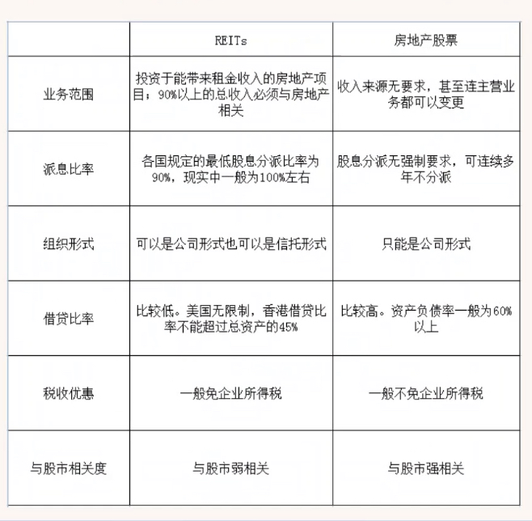
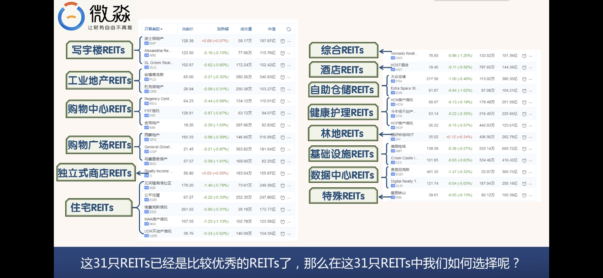

# 房地产投资方法

## REITS投资方法
* REITs 和 房地产股票区别如下
	
* REITs 的内涵
	* REITs必须把至少90%的年度应税收入分派给其份额持有人
	* REITs必须把至少75%的资产投资于不动产，抵押贷款，其他REITs,现金或是政府债券
	* REITs至少75%的总收入必须从租金，抵押贷款利息，物业出售利得中获得
	* REITs必须是房地产投资者，而不是其他任何形式的金融机构
	* REIT的份额持有人至少要100人以上，并且集中在任意5人手中的份额必须小于已发行总额的50%
	* 每年需要进行
		* 收入测试，分配测试，资产测试，组织测试，所有权测试
* REITs的类型
	* 权益型REITs 指直接投资拥有房地产，其收入主要来源于房地产租金收入的REITs，根据持有物业类型不同
		* 零售REITs，住宅REITs，写字楼REITs，酒店REITs，工业地产REITs，健康护理REITs，自助存储REITs
	* 抵押型REITs 指本身不直接拥有物业，而是通过房地产抵押贷款的形式把资金贷出去，赚取利息收益的REITs
		* 分红率较高  资产负债率比较高，对利率变动比价敏感，风险更大
	* 混合型REITs
		* 即持有物业，又存在抵押
* REITs的特点：
	* 定期强制高分红 --- 每年至少要把净收入的90%分配给投资者
		* 美国一般每季度派息一次
		* 香港一般每半年派息一次
	* 投资门槛低
		* 香港REITs 一手起买，一手为1000股
		* 美国REITs 1股起买
	* 交易成本低   一般REITs会免企业所得税
		* 买卖REITs只需要支付交易佣金，没有其他高额税费
		* 直投房地产，买卖税费在房价的10%~30%之间
	* 流动性强
	* 专业化管理
	* 收益率相对较高
* REITs的主要风险
	* 市场风险  --- 房价因周期性涨跌带来的风险 --> 好价格买进
		* REITs的价值由REITs所持物业的价值决定
		* 长期内，REITs的涨跌由房地产市场运行周期决定
		* 波动幅度强于房地产市场，运行周期先于房地产市场
	* 利率风险 -- 利率大幅提高，会减少REITs内在价值，增加REITs债务成本 --> 不要在加息周期的初期买进
		* REITs租金不变情况下，分红资金减少，会降低REITs分红率，导致REITs价格下跌
	* 社会风险 --- 大的社会事件带来房地产下跌的风险 ->选择社会风险小的国家
		* 政治运动：暴乱，战争等
	* 汇率风险 -- 持有REITs期间，因REITs计价货币大幅贬值而导致投资实际亏损的风险 --> 选择货币发行有严格法律约束的国家的REITs
	* 经营管理风险---由于REITs管理团队专业能力不强造成的风险 -> 选择历史表现优秀的REITs
		* REITs最终价值由物业的价值和管理团队的价值共同决定 
	* 债务风险---由于资产负债率过高导致的风险 --> 避免买入资产负债率过高的REITs（大于50%）
		* 主要由于经营管理水平不行导致的
		* 高资产负债率的REITs，将难再获得债务融资
		* 遇利率大幅上涨或信贷紧缩，REITs可能会破产  
	* 增发的风险--增发REITs份额导致每股净资产下降，带来REITs股价下跌的风险
		* 当REITs难再通过债务进行融资时
		* 出现收购机会，REITs很可能会通过增发份额对投资者进行融资
		* 会在短期内导致REITs下跌
		* 风险化解的方式：尽量选择资产负债率过低的REITs
			* 美国REITs的资产负债率最好 < 40%
			* 香港REITs的资产负债率最好 < 30%

### 香港REITs

#### 分类
* 酒店REITs --- 酒店客户都是个人且没有租约，所以酒店对于经济周期最敏感
	* 酒店REITs把酒店租给酒店运营方去运营
	* 酒店REITs一般会和酒店承担方签订基本租金加浮动租金合同
	* 经济好，浮动租金较多，酒店REITs分红率高，价格会出现较大上涨
	* 经济不好，可能会没有浮动租金，酒店REITs分红率下降，价格会出现较大下跌 
* 写字楼REITs 一般都是企业客户，租约一般在2年以上
	* 写字楼与写字楼之间的差别比较大
	* 一线城市核心地段甲级写字楼，出租率和租金水平高，现金流稳定，风险相对较小
	* 非核心地段写字楼，出租率和租金水平比较低，风险比较大
	* 写字楼的周期会滞后于经济周期
	* 评价写字楼REITs要重点看其持有写字楼的质量
* 零售REITs 主要包括社区购物中心和大型购物广场
	* 电子商务高速发展，中低端购物中心收到冲击较大
	* 高端购物广场收到的影响相对较小
	* 一线城市核心地段高端购物广场，盈利能力强，抗风险能力强
	* 评价零售REITs要重点看其持有购物广场的质量
* 综合REITs 持有2种或以上类型的物业且其中任意一种物业的价值占总物业价值的比例不超过50%的REITs
	* 综合REITs持有多种物业
	* 不同物业组合在不同经济周期都能为REITs带来持续的现金流
	* 评价综合REITs的好坏主要也是看其拥有的物业质量
* 不同类型REITs风险比较
	* 假设不同类型REITs持有的都是最好的物业以及团队管理能力相似
	* 酒店REITs的风险 > 写字楼REITs > 零售REITs > 大于综合REITs
	* 管理团队的好坏对REITs的影响很大

#### 年报和招股说明书       
* 香港交易所可以下载年报和招股说明书
	* [香港交易所](http://www.hkexnews.hk/listedco/listconews/advancedsearch/search_active_main_c.aspx) 
* 招股说明书重要部分
	* 投资主要风险
	* 发售通函概要
	* 风险因数
	* 分派政策
* 年报重要部分
	* 财务摘要
	* 主席报告
	* 管理层讨论与分析
	* 综合全面收益表
	* 分派表
	* 综合财务状况表
	* 综合现金流量表
	* 综合财务报表附注
	* 词汇表

#####  读年报的目的
* 了解REITs的物业情况
* 了解REITs的财务状况
* 了解REITs管理团队的能力
* 指标
	* 财务摘要
		* 物业收入净额 = 总租金收入 - （与租金收入相关的各种税+房产税+保险费+水电费+物业管理费等）REITs管理人收的管理费，受托人收的托管费，财务费用，折旧费，资本支出不计入运营费用
		* 可供分派金额 （直接决定投资者能分到多少钱）
		* 分派金额（当年分派给投资者的钱）
		* 每个基金单位分派 每个基金份额可以分到的钱
		* 每基金单位分派/12月31日收盘价 = 分派收益率
		* 增加REITs价值或者说增加REITs可供分派金额的方式
			* 内部增长 --> 提升物业出租率，提高租金水平，降低物业运营成本，提高租客质量，物业翻新，物业置换等方式提高物业的现金流-->是可供分派金额增长最稳当和可靠的方式 
			* 外部增长 --> 通过收购，开发新物业来赠加REITs的现金流 --> 贷款或增发新股 -> 不稳定   
	* 综合收益表
		* 物业收入净额以及变化情况 -- 最重要
		* 财务费，管理人费以及变化情况
		* 分派前净利润
		* 投资物业公允价值减少  指物业每年市值的减少 今年 - 去年 影响账面价值 影响净利润和资产负债表中的延迟税项  不影响可供分派收入
		* 补足额资产之公允价值收益，指补足所承诺金额的差额部分
		* 折旧与摊销  折旧--> 酒店，公寓物业设备的折旧，摊销-->因收购产生的商誉等无形资产的摊销
		* 其他运营开支
		* 融资成本  -- 贷款利息支出 增加会减少可分派金额（重要）
		* 汇兑亏损 --> 拥有外币资产或外币负债因汇率波动产生的账面亏损
		* 管理人费用 --> 指支付给信托管理人的费用
		* 房地产投资信托基金开支 --> 指房地产投资信托的运营开支
		* 除税前及与基金单位持有人交易前之盈利 --> 利润总额
		* 所得税开支
		* 净利润
	* 分派表 
		* 可供分派金额怎么来的，以及可供分派金额的变化情况
		* 分派金额以及分派比率的变化情况
		* 每股分红的变化情况
		* 可供分派收入 = 净利润+少数股东权益+（非现金支出-非现金收入）
	* 综合财务状况表 --> 合并资产负债表
		* REITs 物业价值如何
		* REITs 的短期债务风险如何
		* REITs的长期债务风险如何
		* REITs的净资产如何
		* 物业估值方法 ： 资本化率估值法
			* 资本化率 = 物业收入净额 / 物业价值 * 100%
			* 资本化率 > 7% --> 物业市场价值低于其内在价值
			* 资本化率 < 7% --> 物业市场价值高于其内在价值
	* 综合现金流量表 -> 合并现金流量表
	* 了解REITs管理团队的能力
		* 物业收入净额 从上市至今稳定增长
		* 股利分派   从上市以来至今稳定增长
		* 借贷比率 调整后计算的借贷比例 < 30%
		* 融资能力 融资渠道越多，对于REITs越有利，融资成本低，少抵押融资
		* 历史收购 收购后资产的盈利能力的变化 
##### 招股说明书
* 风险因数（重要）
* 分派政策
* 发售通函
* 架构

#### 等待好价格
* 分红率法
	* 香港REITs动态分红率的合理波动区间为5%~10%
	* 高于10%为好价格
	* 低于5%为卖出时机

#### 买进
* 分批买进，买进3-5只不同类型的REITs
* 把资金分成三份，当目标REITs分红率>10%以上时，开始买进
* 目标价格每下跌 5%-10%  --> 买进一次，至资金买完

#### 长期持有
* 10年以上，特别优秀的30年以上

#### 卖出
* 当所有REITs的平均动态分红率小于5%的时候
* 当某只REITs旗下核心物业不再有竞争力的时候  出租率低于90%

### 美国REITs投资方法
#### 选出好REITs
* 选出标准普尔500指数成分股的REITs
* 

#### 精选
* 把资产负债率 > 50% 的美国REITs淘汰
* 历史分红不稳定的淘汰掉

#### 等待好价格
* 分红率法
	* 美国REITs动态分红率的合理波动区间为4%~8%
	* 高于8%为好价格
	* 低于4%为卖出时机
* 年报下载 (搜索 10-k)
	* 直接到对应REITs的网站上下载
	* [到美国证监会网站上下载](https://www.sec.gov/edgar/searchedgar/companysearch.html)
	* 必看内容
		* 商业
		* 风险因数
		* 所选财务数据
		* 和业务成果的讨论与分析
		* 财务报表和补充资料
		* 财务报表和附表指标
	* 查看目标，了解以下信息
		* 物业情况
		* 盈利能力
		* 债务风险
		* 管理团队能力
	* NOI 物业收入净额
	* FFO 运营现金流 -- 可供分派金额  
	* 债务风险
		* 合并资产负债表-> 总资产，总负债，抵押负债->资产负债率，借贷比率
		* 债务期限结构和利率结构-> 固定利率债务，可变利率债务，期限结构 

#### 买进
* 分批买进，买进3-5只不同类型的REITs
* 把资金分成三份，当目标REITs分红率>10%以上时，开始买进
* 目标价格每下跌 5%-10%  --> 买进一次，至资金买完

#### 长期持有
* 10年以上，特别优秀的30年以上
* 派息按季度（少数按月）
* 中国投资者获得美国REITs分红需要扣除10%的税
* 美国投资者获得美国REITs分红需要扣除15%的税

#### 卖出
* 当所有REITs的平均动态分红率小于4%的时候
* 当某只REITs旗下核心物业不再有竞争力的时候

## 商品房投资方法

### 房地产投资引言
* 在没有把握的时候，房地产投资可以参考房地产首富的行为，在房地产首富大量卖出的时候要警惕泡沫

### 房地产是什么
* 生活角度 ---- 居住功能
* 投资角度 ---- 财富再分配的工具

### 房地产的种类
* 住宅
* 商铺
* 购物广场
* 写字楼
* 酒店
* 工业地产

* 在所有类型的房地产中，住宅相对是最容易变现的，交易税费相对是最少的，贷款利率相对是最低的， 贷款期限相对是最长的，所以投资风险也相对是最小的。 
* 我们这里说的住宅指的就是商品房。在中国商品房主要指的就是有产权的住宅。

### 住宅的种类
* 普通住宅 --- 产权70年，面积小于140平，市场需求量最大
* 公寓
	* 住宅公寓 --- 产权70年，和普通住宅没什么区别
	* 商业公寓 --- 产权一般为40或50年，贷款和税费成本均高于普通住宅，且不能落户，上学。商业公寓虽然可以居住，但是不属于住宅。
* 联排别墅 --- 产权70年，是介于普通住宅与独栋别墅之间的一种别墅。可以看作经济适用型别墅。是为买不起独栋别墅但又想住别墅的人准备的。 
* 独栋别墅 --- 产权为 70 年，住宅中的最高级别

* 从投资角度考虑，普通住宅和其他几种类型的住宅相比:
	* 是最容易出租和出售的
	* 交易和持有税费是最低的
	* 贷款比例是最高的
	* 贷款利率是最低的
* 综合来看，普通住宅的投资风险在住宅中相对是最小的

### 房地产投资的特点
* 投资金额较大
	* 一线城市一般需要准备 100 万人民币的首付款。
	* 二三线城市一般需要准备 30 万的首付款。
*  税费成本较高 ----- 在买入房产、持有房产、卖出房产时都会涉及到较高的税费。
	* 在中国，目前买房时所付的税费为买入价的 2%-5%，实际税费大概为买入价的 5%-25%。因为楼市比较热的时候，卖家会把税费转嫁给买家,持有房产期间所付的税费大概为租金的 5%-15%。卖房时所付的税费大概为卖出价的 2%-20%，目前实际税费大概为卖出价的 1%-2%，因为卖家会把税费转嫁给买家。
	* 这种情况会因房地产市场的变化而变化，在房地产市场下跌的时候，卖方就很难再把税费转嫁到买方头
上了。
	* 其实房地产交易的税费成本在海外也很高。在美国，买房时所付的税费大概是:不贷款约为购买价 的 1%—3%，贷款约为购买价的 2%—4%;持有房产期间所付的税费大概为租金的 40%-50%;卖房时所付的 税费大概为卖出价 20%-25%
	* 在香港，买房时所付的税费大概是购买价的 32%-35%;持有房产期间所付的税费大概为租金的 20%-30%;卖房时所付的税费大概为卖出价的 1%-2%。
	* 由于税费成本较高，房地产一旦买入，就意味着已经亏损 20%左右了。
*  投资期限长
	* 由于税费成本高，房价要上涨 20%以上才能达到盈亏平衡。 
	* 在高税费成本之下，唯有低频交易，长期持有才是明智的选择。如果不打算持有房产 10 年以上，就不 要进行房地产投资。
* 融资能力强
	* 房地产可以按揭贷款，普通住宅一般可以贷到房产评估金额的 70%-80%，期限一般在 20-30 年。
	* 这是股票、公司、债券、基金等其他投资工具没有的优势。房地产这个特有的优势如果使用好了，可以
提高投资回报率。
*  交易流程复杂
	* 房地产投资涉及的环节相对较多，也比较复杂。一个人很难完成所有的工作。从购买房子到出租，再到 后期出售，我们都需要他人的协助。无论买房还是卖房的过程一般都需要几个月的时间。
	* 如果嫌直接投资房地产比较麻烦的同学，就不要直接投资房地产。可以选择投资 REITs

### 房地产的主要风险
*  市场风险
	* 市场风险是最常见的风险，是指房价因周期性涨跌带来的风险。化解市场风险最有效的途径就是在“好价格”买进。
* 政策风险
	* 政府为了抑制房产泡沫，采取限购、限卖、限贷、增加土地供给等政策导致房价下跌的风险。
	* 化解政策风险最有效的途径是“好价格”。
* 社会风险
	* 社会风险是指大的社会事件带来房价下跌的风险。社会风险主要有:政治运动、暴乱、战争等。
	* 当时房价暴跌之后，李嘉诚进行了大抄底，李嘉诚也因此成为了香港首富。
	* 化解社会风险的有效途径就是选择社会稳定性比较好的地区进行投资。
* 变现风险
	* 现风险是指以市场价卖不掉房地产的风险。房地产的金额较大，交易流程比较复杂。一般房地产从开 始出售到交易完成需要 1-6 个月的时间。如果在楼市下行的时候，可能要比市场价低 20%以上才能卖掉。
	* 能有效降低变现风险的方式是选择“好房子”。
* 利率风险
	* 因利率大幅提高导致房价下跌的风险。央行可能会根据内外部经济形势的变化而大幅提高利率。利率大 幅提高，至少会从三个方面影响房价。
		* 利率提高，房地产的内在价值变小，房价会下跌;
		* 买房的成本提高，需求会减少， 房价会下跌;
		* 每月按揭贷款还款额会大幅提高，很多人可能会因此断供，房价会下跌。
	* 化解利率风险的有效途径是“好价格”。
* 汇率风险
	* 汇率风险指在持有房地产期间，因房地产所在国货币大幅贬值而导致投资实际亏损的风险。房地产投资一般至少需要持有 10 年以上，在这期间房地产所在国的货币汇率可能出现大幅贬值。
	* 化解汇率风险有效的方式是选择货币发行有严格法律约束的国家。
* 自然风险
	* 因地震、洪水、海啸、飓风、火灾等自然灾害导致房地产严重损坏的风险。
	* 化解的方式是避免在以上自然灾害高发地区投资房产

### 房地产的主要收益来源
* 租金收益
	* 租金收益是确定性很强的收益，我们通过房子实现财务自由主要靠的就是租金收益。只有净租金收益率 比较高的房地产才值得我们投资
	* 净租金收入小于 0 的房产为“耗钱资产”，没有投资价值，只有投机价值。真正的房产投资者是非常重
视租金收益的。房产投资者的买卖决策主要是基于租金收益情况做出的。
* 资本利得 
	* 资本利得就是房价增值收益。资本利得的回报率可能会比较高，但是有极强的不确定性。我们投资房子的时候应当把资本利得看作租金收益之外的额外收益，有当然很好，没有也没有关系。 
	* 在我们做购买决策时，不用考虑未来的价差收益。在不考虑价差收益的前提下，依然具有投资价值的房 子才真正具有投资价值。

### 商品房投资方法

* 选择好城市
	* 在中国最好的城市就是北、上、深、广。 
	* 不方便在北、上、深、广投资的同学也可以选择离自己比较近的省会或地级城市。
	* 不过在选择省会或地级市的时候要注意一点，那就是这个城市过去连续 3 年每年的人口都是净流入的。如果过去几年的人口是净流出的，这个城市正在走向衰落，这个城市的房子不能投资。
	* 人口数量变动情况我们可以在[各地方政府的统计网站上查询。](http://www.stats.gov.cn/)
		* [国家统计局的网站](http://www.stats.gov.cn/) -> 地方统计网站 -> 统计数据 -> 人口与就业 -> “常住人口(1978-2016)”和“常住人口总量(分 区)
		* 只要“城镇人口”和“常住外来人口”连续 3 年都是净流入的城市就可以算作好城市。
		* 好区域一般是常住外来人口集中流入的区域:
			* 因为这些区域的就业机会相对较多，或者有一些其他的优势。（常住人口总量(分区)(这个文件）
			* 选择 常住外来人口所占比重 高于全地区的地区
* 选择好房子
	* 好地段;
		* 市中心是好地段，但是好地段并不一定是市中心
		* 地段就是一切便利性的总和。好地段就是生活很便利的区域。比如交通要便利;吃饭要便利;购物要便 利;娱乐要便利;上学要便利;看病要便利。
		* 房子离地铁站的距离步行小于 10 分钟，就符合交通便利的标准。步行时间越短则越便利。房子周围步行 15 分钟以内的范围内有超市、高、中、低档餐馆，就符合吃饭做饭便利的标准。 
		* 房子周围步行 30 分钟以内的范围内有大型商场，大型超市，电影院，娱乐设施就符合购物便利、娱乐便利的标准。
		* 房子是好学区的学区房，就符合上学便利的标准。
		* 房子离医院的距离在 5 公里以内，就符合看病便利的标准。
		* 当然也不是要全部符合以上标准的地段才是好地段，只要满足交通便利、吃饭便利、购物便利、娱乐便利就算是好地段了。
		* 上学便利和看病便利属于加分项，有了可以加分，没有也没关系。
	* 好环境;
		* 环境指小区外部环境。好环境不是指环境优美，而是指环境没有污染。当然环境优美了会更好。
		* 常见的环境污染主要包括:
			* 1、噪音污染;
			* 2、空气污染;
			* 3、电磁污染;
			* 4、水污染。
			* 房子要远离火车 站、铁道、高架桥、垃圾站、高压线、变电站、电视塔、臭水坑等产生污染的源头，距离至少要大于 1000 米。 
	* 好物管;
		* 好物管指小区的物业管理要好。好的物业管理能让房子增值。有的房子过了 10 多年就显得很破旧，有 的房子过了 10 多年和新的差不多。这主要是物业管理的不同。
		* 判断小区物业管理水平也很简单，到小区里转一圈，看看小区内房子的老化程度、卫生情况、绿化情况、 车辆摆放情况，基本就能知道小区物业管理做的如何了。
		* 只要小区的房子看起来像新的一样，地面干净，小区内环境看作顺眼。就可以认为该小区的物业管理做 的好。 
	* 好户型;
		* 好户型指最容易出租和出售的户型。
		* 统计局的网站 -> 统计数据 -> 人民生活 -> 全市居民家庭居住构成情况
	* 房龄小;
		* 房龄指自房屋竣工验收合格交付之日起到现在的年限。不是房产证上的日期
		* 首先明确一点，从投资的角度考虑，我们只投资精装修的二手房。因为二手房价格比新房要便宜，而且 买了以后可以直接出租产生现金流。投资二手房比投资新房的风险和成本都要小
		* 不过虽然我们投资的是二手房，但是我们对于房龄却是有严格要求的。因为银行一般对于房龄超过 20-25 年的房子就不提供贷款了。我们要考虑到卖房时，能贷款的房子要比不能贷款的房子更容易出售。
		* 按我们会持有房子 10 年来估算，我们买二手房的时候，房龄最好不要超过 10 年，如果房子其他条件 特别好的，可以适当延长几年，但是不能超过 15 年。
		* 房龄超过 15 年的房子我们直接淘汰掉。具体的房龄去小区物业问一下就可以了。 
	* 空置低
		* 空置低是指没有人居住的房屋比例低。当前 5 条都满足了以后，我们还要看一下房屋的空置率。空置率 越低，说明该区域的房子越容易出租，投资价值越大。空置率不但要看目标小区的，还要看周圈小区的。
		* 周围小区的空置率如果也很低，说明整片区域的房子都容易出租。投资的安全性比较高。
		* 国际通行惯例，空置率在 5%---10%之间为合理区，房屋供求平衡;空置率在 10%---20%之间为空置 危险区;空置率在 20%以上为严重积压区。
		* 在中国空置率小于 10%即可看作空置率低，小于 20%可看作合理。空置率大于 20%的小区，不要投 资。
		* 想要了解一个小区的空置率，最简单的办法就是晚上 9 点多的时候，在小区外面数数一栋楼里有多少房 间是不亮灯的，就能得出一个大概的空置率。 
	 
* 等待好价格
	* 关于房地产周期，有一个著名的哈里森房地产 18 年周期模型。
		* 哈里森研究了 200 多年来英国和美国的经济和房地产史，他认为:房地产的周期是 18 年左右，通常前 14 年房价是上涨的，后 4 年房价是下跌的。
		* 在前 14 年的上涨过程中，通常又分为 3 个阶段。第一阶段是缓慢上涨阶段，这个时间通常在 7 年左右。 在第 7 年左右可能会有一个短暂的下跌过程，短暂的下跌过程结束之后，房价会进入到第二个阶段，快速上涨阶段。
		* 这个时间通常在 5 年左右。快速上涨阶段之后，房价会进入到第三个阶段，疯狂上涨阶段。这个时间通 常在 2 年左右。 
		* 疯狂上涨阶段结束之后，房价进入崩溃式下跌阶段，这个时间通常在 4 年左右。
		* 在下跌阶段结束之后，房地产会进入新的上涨阶段。
	* 在我们投资房子的时候只要看净租金收益就可以了。我们可以用净租金收益率来衡量净租金收益的好坏。
		* 净租金收益率=年租金净额÷初始投资现金总额×100%=(年租金总额-年物业费-年房屋保险费-年房产税-年租金相关税-年房屋维护费-年房屋出租托管费-年按揭贷款本息-其他费用)÷(首付+购房产生的税费)×100% 
		* 因为要长期持有，我们可以把 10 期国债收益率看作机会成本。当净租金收益率大于 10 年期国债收益的中位数时，此时买入房子没有风险。此时的价格就是好价格。
		* 我们可以看到过去 15 年 10 年期国债收益率的中位数为 3.8%。也就是当房子的净租金收益率大于等于 3.8%的时候，投资房子是没有风险的。
		* 净租金收益等于 3.8%时对应的价格就是“好价格”，房价低于这个价格越多，就越有投资价值。
		* 在中国，持有房子的成本一般为租金 5%-15%，我们按 10%估算
		* [房贷计算器的网址](https://www.rong360.com/calculator/fangdai.html)
		* 所以好价格为 （租金 * 12 * 0.9 - 按揭金额）/ (首付+买入时的交易费用（一般为总价的5%）) >= 十年国债收益
* 买入房地产
	* 注意事项
		* 产权有问题的房子不买
			* 我们只考虑 70 年产权的商品房，其他类型的房子不考虑。有些房子价格可能很便宜，但是产权有问题，这种房子风险很大，坚决不买 
			* 市场上有些专门投资“法拍屋”的投资者，也取得了不错的收益。像这种对于专业技能要求很高的投资项目就不在我们的考虑范围之内。
		* 房龄大于 15 年不买
		* 不是精装修不买
			* 目前市场上有很多没有装修的二手房。如果自住，买这样的房子按自己喜欢的风格装修是一个不错的选择。但是我们买房子是用来投资的。买了以后马上能出租掉才是最好的选择。
		* 贷款比例低于 50%不买
			 * 贷款比例低于 50%，贷款期限小于 15 年的房子不买。我们投资房子要尽可能的去利用银行的资金来提升投资回报率。
			 * 如果说直接持有房子和通过 REITs 间接持有房子相对有什么优势的话?那就是直接持有房子可以向银行贷款，增加杠杆，提高收益率。如果贷款比例低于 50%，我们还不如直接投资 REITs 来的简单容易。 
		* 空置率大于 20%不买 
		* 感觉不好不买    
* 长期持有 
* 卖出房地产
	* 国际上一般用房价收入比和租售比两个指标来衡量房地产市场有没有泡沫
	* 由于中国在收入统计上的数据是不准确的，所以房价收入比这个指标在中国是不适用的。我们用租售比这个指标来衡量中国房地产市场有没有泡沫。
	* 租售比的计算公式是:租售比 = 月租金/房价
	* 国际上认为合理的租售比为 1:200~1:300。如果租售比低于 1:300，说明房价出现泡沫，没有投资价值;而如果高于 1:200，说明租金回报率较高，有投资价值。
	* 根据国际标准，当售租比（租售比的倒数）大于 300 的时候，房价有泡沫。
	* 在美国，当售租比大于 300 的时候，房价一般会见顶
	* 在中国用售租比大于 300 来判断房价有泡沫是不合理的，因为中国和美国持有房产的成本是不一样的，美国房产的持有成本远高于中国。
		*  比如同样 10 万元的租金收入，在中国扣掉物业费、房屋保险费、房屋维护费等必要支出之后，大概会剩下 9 万元的净收入。
		*  在美国扣掉物业费、房产税、保险费、房屋维护费、租金个人所得税、房屋出租托管费等必要支出之后， 大概只剩下 5 万元
	* 我们发现在相同租金收入水平下，中国房产的净租金收入是美国房产的 1.8 倍左右。由于房子的内在价 值是由净租金收入水平决定的，而不是由租金收入水平决定的。
	* 所以中国的售租比应该调整为:300*1.8=540。也就是当中国房子的售租比大于 540 的时候，中国的 房地产市场是有泡沫的，此时就是卖房的时候。

### 房地产研发分析工具
#### 房地产资产负债表
#### 房地产现金流量表
#### 房地产买卖的关键指标 
 

         	   
	 