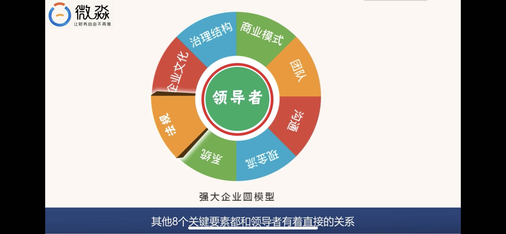
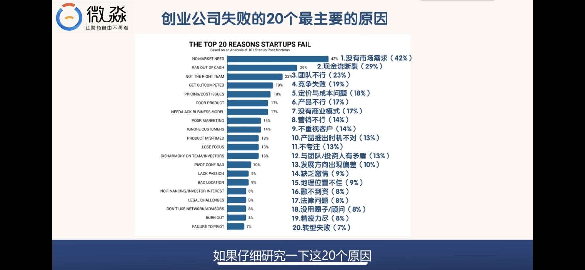
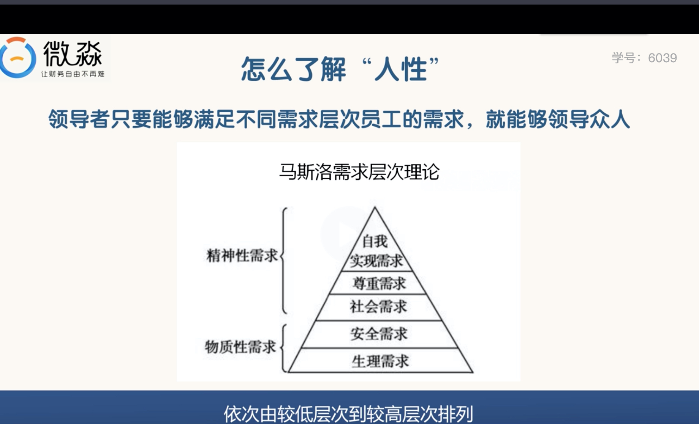
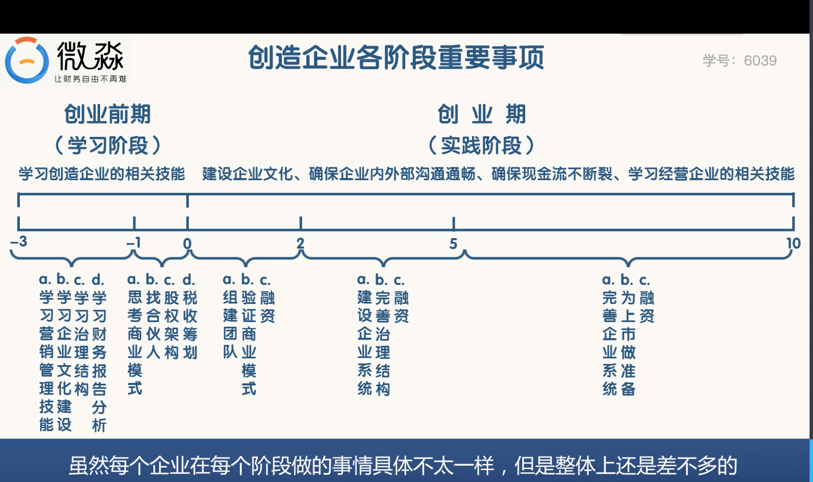

# 创造企业的方法论

## 创造企业前相关知识
* 股权结构
* 公司治理结构
* 营销、销售
* 团队管理
* 商业模式
* 企业文化建设
* 财务管理

## 强大企业圆模型

* 其中1，6，7 归结于商业模式（占比76%）
	* 商业模式主要包括，用户模式，产品模式，推广模式，盈利模式（市场，用户，产品，推广，定价） 
* 第2，16 归属于现金流（占比37%）
* 第3，14 归结于团队 （占比32%）
* 第8，第12 归结于沟通 （占比27%）
* 第9 归结于企业文化 （占比14%）
	* 企业文化指企业的使命，愿景，核心价值观  
* 第11，13，20 归结于治理结构 （占比30%）
* 第17 归结于法规 （占比8%）
* 第19 归结于系统 （占比8%）
	* 系统指 企业各部门的运作实现标准化、流程化、降低了对人的依赖，提高效率 

## 各要素简介
* 领导者
* 企业文化
	* 愿景
	* 使命
	* 目标
	* 核心价值观 
* 治理结构
	* 股权结构 主要指各股东的持股比例，决定了股东在股东大会中的权利
		* 股份少意味着对股东大会的控制弱，容易失去对董事会的控制
		* 解决方法：合伙人制度
			* 过半的董事会成员必须经阿里巴巴合伙人提名后由股东会投票通过
			* 本质是保证创始人团队以很少的股份控制董事会
	* 公司治理结构 主要指股东大会（权利机构），董事会（决策机构），监事会（监督机构），总经理（执行机构）之间的关系

* 商业模式
	* 产品模式
	* 用户模式（服务对象）
	* 推广模式
	* 盈利模式 
* 团队
* 沟通
	* 内部沟通 -- 主要指公司内部上下级、各部门之间的沟通
	* 外部沟通 -- 主要指公司与客户、媒体、政府部门之间的沟通
* 现金流
* 系统
	* 企业系统由各个子系统组成
		* 决策、管理、营销、组织、财务、运营、研发、支付等
* 法规  	     
	
## 领导者
* 有志 --- 有梦想
	* 要有宏大的目标
	* 这个世界上只有不到3%的人制定了宏大的目标
	* 制定了目标，然后去实现它 
* 有识 --- 有见识 
	* 能看透事物的本质（能处理好眼前事）、规律（就会有远见）；了解人性（能激励和领导众人）
		* 看透事物本质---5why分析法（虽为5个为什么，但使用时不限定问的次数）
		* 用好5why分析法的关键是：
			* 解决问题的人要避开主观或自负的假设，实事求是，沿着因果关系链条，找到原有问题的根本原因
		* 怎么了解人性
			* 领导者只要能够满足不同需求层次员工的需求，就能够领导众人
			* 马斯洛需求层次理论
				   
			* 从生理需求出发
				* 企业至少为员工提供一份能满足基本生活的基本工资+丰厚的奖金制度
				* 企业要加班，也不要让员工加班到太晚
			* 从安全需求出发 -- 员工需要工作保障、职业发展保障、养老保障等
				* 企业要有明确的制度来保障员工的权益
				* 晋升制度、激励制度要公平、公开、公正
				* 除基本社会保障，企业还可以在员工的养老保障方面进行设计
			* 从社会需求出发 --- 员工需要被关爱
				* 企业要设计对员工的关爱制度
				* 企业要充满快乐，充满爱
			*  从尊重需求出发 --- 员工需要荣誉感、成就感、地位、高度评价
				* 企业要举行表彰大会
				* 企业要设立晋升制度
			*  从自我实现的需求出发 -- 员工需要实现梦想
				* 企业要给卓越员工一个施展的平台
				* 卓越员工可以在企业的平台上创业
				* 企业通过资金、人才、管理、技术进行扶持
* 有恒 -- 持之以恒，坚持不懈
	* 给自己下要求
		* 每天坚持读书1小时
		* 每天坚持早起，夏天5：30起床，冬天6：00起床
		* 每天背单词
* 有仁 -- 就是有爱 （做什么事情能让 *** 变的更好）
	* 一个人能让别人变的更好，就叫爱别人
	* 一个人能让自己变得更好，就是爱自己    
* 有才 -- 有一技之长
	* 这个一技之长最好能够达到本领域内Top5%水平
	* 只有最优秀的人才能吸引最优秀的人 
* 好学 -- 养成学习的习惯
	* 不喜欢学习，但是养成了学习的习惯也是好学
	* 学习的习惯一旦形成，学习能力就会快速提高
	* 学习能力是一个人最核心的竞争力
	* 学习能力本质就是模仿能力。模仿能力是人天生的能力
	* 如何快速学习
		* 明确学习目标 -- 在某段时间内，重点学习某项技能
			* 首先明确要学习什么，比如营销技能、沟通技能等
			* 在某个时间段只重点学习一项技能
		* 系统性学习 -- 大量全面的学习
			* 可以通过读书和在线课程的方式学习
			* 买下某项技能的全部书籍
			* 逐一阅读，阅读过程中划重点，做笔记
			* 筛选出比较好的书，再重点读一遍或多遍
			* 参加一些实战高手的讲座或者课程
		* 在脑海中教别人
			* 在教的过程中能发现自己哪些东西没有掌握好
			* 现实中经常教别人的机会可能比较少，那就在脑海中想象你在教别人
			* 通过想象教别人，大脑就会开始把前面学的知识进行组合
			* 在组合的过程中是自己吸收掌握最快的时候
			* 要做到把书本上的词汇用自己的话语讲出来
		* 回头再学
			* 如果在脑海中教别人过程遇到问题，说明自己还没有全部掌握
			* 针对专门的问题回头去学习
			* 直到能流畅的把自己学的东西教给别人
		* 实践
	
* 领导者需要做的9件事情
	* 领导者首先要让自己成为一个好的领导者
		* 领导者首先要让自己变强，内圣才能外王
		* 领导者要把 领导者的6大特点 作为一面镜子，经常照一下自己
	* 领导者要建立企业文化，并且捍卫企业文化
		* 企业文化建设的核心是明确企业的使命、愿景、核心价值观
		* 把企业文化写在纸上并考核
		* 捍卫企业文化的意思是，无论是谁只要其行为与企业的使命、核心价值观相违背。就要受到惩罚
	* 领导者要构建和完善公司的治理结构
		* 领导者在公司没有成立之前就要设计公司的治理结构
		* 公司成立初期最重要的是股权结构
		* 股权结构决定了后期的公司治理结构
	* 领导者要找到好的商业模式
		* 商业模式包括用户模式，产品模式，推广模式，盈利模式
		* 商业模式的好坏直接决定了企业后期能做多大，盈利能力如何
	* 领导者要找到合适的人并把他们组成一个团队
		* 合适的人指能力过硬，价值观匹配的人
	* 领导者要确保现金流不断裂
		* 现金流是企业的血液，一旦断裂企业基本就死了
		* 领导者要让企业现金流变的强大
		* 底线是现金流不能断裂
	* 领导者要确保内外沟通畅通
		* 内部沟通主要指管理，外部沟通主要指营销
		* 核心团队成员大规模离职的企业，内部沟通肯定没做好
		* 营业收入不行的公司，外部沟通肯定有问题
	* 领导者要建立强大的企业系统
		* 强大企业的组织系统、管理系统、营销系统、财务系统等都应该有条不紊的运行
		* 领导者要建立一个离开了自己还能正常运转的企业系统
	* 领导者要用法律武器保护企业
		* 不能让企业从事违法的事情，基本前提
		* 另外企业领导者要懂得利用法律武器保护企业
		* 至少要具备知识产权、商标、专利保护方面的意识
		* 如果领导者能够为企业进行税收筹划，就更好了

## 企业文化
* 企业的信仰，企业的行动纲领
	* 洛克菲勒家族的家庭文化
		* 认真对待每一分钱 （记账，零用钱使用协议）
		* 诚信
		* 能者居上
		* 善良有爱 
* 企业文化三要素
	* 使命 （驱动力）-- 梦想 （企业围绕梦想）
		* 例如 阿里 --- 让天下没有难做的生意 
	* 愿景 （感召力）-- 长期大目标 
		* 例如：成为一家持续发展102年的公司等 
	* 核心价值观 （统合力）--- 自我实现守则
		* 例如：守信，创新，以用户为核心等 
* 如何建设企业文化
	* 如何确定使命
		* 企业为什么要存在？
		* 当你发现了社会中存在的一些问题，并决定要创造一个企业去解决某个问题的时候，你就找到了企业的使命
		* 发现很多问题，受限于资源，只能解决其中一个，问自己 企业解决哪个问题最可能成为第一名，这个问题的答案就是你应该选择的行业
		* 注意事项
			* 使命一定要是‘虚’的，而不是‘实’的
			* 使命一定要有爱，爱就是让他人变的更好
			* 使命要能让自己热血沸腾
			* 一般 让、使、为开头 
			* 使命一旦确定，就不能再改变
	* 如何确定愿景  
		* 愿景就是企业长期大目标，也是企业全体人员奋斗的目标
		* 原则：
			* 愿景一定是要‘实’的，而不是‘虚’的
			* 愿景要宏大且能让员工受益
				* 愿景要能满足员工的物质需求和精神需求，两者缺一不可
				* 宏大目标让员工获得成就感和实现自我价值，这是精神层面的
				* 让员工受益，主要是指物质层面的
			* 一般使用  成为，让 开头   
			* 愿景是可以变化的
				* 愿景就是长期目标，目标就是用来实现的
				* 一旦企业将要实现愿景，愿景就必须进行调整
				* 当企业实现了原来的愿景又没有新的愿景是，企业就会迷失 
    * 如何确定核心价值观
    	* 价值观就是对错的评判标准
    	* 企业的核心价值观就是企业对于对错的评判标准
    	* 企业坚持什么，反对什么，这个问题的答案就是企业的核心价值观
    	* 原则
    		* 价值观要正
    			* 企业的价值观要符合道德规范
    			* 要能激发人性中的真、善、美
    		* 企业的核心价值观要和创始人的价值观一致
    			* 如果不一致，创始人必定不能践行和捍卫企业核心价值观
    			* 企业的核心价值观就成了口号，没有任何作用
    		* 核心价值观的数量最好在3~6个之间
    		* 核心价值观不能改变  

## 治理结构
* 公司治理结构简单的说就是关于公司最高权力分配与监督的制度框架
* 公司治理结构主要是关于股东大会、董事会和总经理三者之间的制度结构
	* 股东大会 --- 最高权力机构
		* 股东大会选举或任免董事和监事成员
		* 公司的重大经营决策需要通过股东大会的批准才能执行 
	* 董事会 --- 最高决策机构
		* 董事会是行驶股东大会职权的常设机构
		* 董事会向股东大会负责，董事会是股东大会的执行机构
		* 除法律和公司章程规定的应由股东大会行驶的权利外，其他事项均可由董事会决定
		* 董事会负责聘请或解聘总经理 
	* 经理层 --- 最高执行机构
		* 总经理是公司业务执行的最高负责人
		* 总经理负责招聘和解聘公司其他员工  
	* 监事会 --- 监督机构
		* 与董事会平级
		* 主要是监督董事会工作
* 员工由总经理任命，总经理由董事会任命，董事会由股东大会任命，股东大会的决议优势股权结构决定的  
	* 股权结构是公司治理结构的基础
	* 如何设计一个好的股权结构
		* 人
			* 核心价值观一致的人才能成为股东
				* 创始人在找股东之前一定要把自己的核心价值观或者企业核心价值观先写下来
				* 找股东的时候，首先考察对方的核心价值观
				* 核心价值观不一致的人，不能成为股东
			* 能力强且与创始人的能力互补
				* 股东的能力应当是他那个领域内的5%
				* 创始人和其他股东的才能不能相同，不然后期只会有更多的争论
			* 认同公司的使命和愿景
			* 出钱（出不出钱的人对于公司的态度是不一样的）
		* 人数
			* 初创公司时，2-4个股东比较好
			* 人数太多会导致沟通困难，沟通成本高，降低公司效率
			* 股东人数多，人的能力肯定会参差不齐，不利于公司的发展 
		* 股份比例  
			* 初创期的公司股份一定不能平均分配
			* 一旦遇到分歧，很难达成一致意见
			* 初创期公司一定要有一个老大，体现在股份比例就是股份比例大于67%，最少也要大于50%
			* 股份大于67%，属于绝对控股
				* 公司法规定修改公司章程，增加或减少注册资本，公司合并，分立，解散，变更公司形式需要股东会三分之二以上有表决权的股东通过才能形成有效的股东会议
				* 掌握67%的股份在表决权上和掌握100%的股份效果是一样的
			* 股份大于50%，属于相对控股 
				* 无法修改公司章程，增加或减少注册资本，公司合并，分立，解散，变更公司形式 
				* 可控制公司日常运营事务
			* 创业期，创始人的水平基本就是公司的最高水平 
 