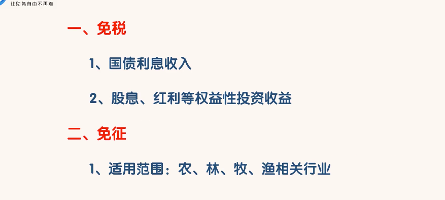

# 法规
* 法律和规定
* 企业要想持续的发展壮大
	* 首先不能违反法规
	* 其次要利用法规来保护企业和自己
	* 还要利用法规来降低成本实现利益最大化

## 如何用法规保护自己和企业
* 保护自己的要点在**有限责任**，保护企业的要点在**知识产权（主要包括著作权，专利权，商标权）** 
* 有限责任即是有限清偿责任
	* 指投资人仅以自己投入企业的资本对企业债务承担清偿责任，资不抵债，其余多余部分的债务免除的责任形式
	* 投资者对企业需要承担有限责任还是无线责任，是由企业的法律形式决定的
* 企业的法律形式分为三种
	* 个人独资企业
		* 指由一个人投资，财产为投资者所有，投资者以个人财产对企业债务承担无限责任的经营实体
		* 税负成本低
		* 特点：
			* 仅由一个自然人投资
			* 仅缴纳个人所得税，不缴纳企业所得税
			* 投资人对企业债务承担无限责任
			* 很难以企业的名义融资
	* 合伙企业
		* 指由各合伙人订立合伙协议，共同出资，共同经营，共享收益，共担风险，并对企业债务承担无线连带责任的营利性组织
		* 分为：
			* 普通合伙企业
				* 有不少于2名合伙人。合伙人可以是自然人、法人、其他组织
				* 只缴纳个人所得税，不缴纳企业所得税
				* 合伙人对企业债务承担无限连带责任
				* 很难以企业的名义融资
			* 有限合伙企业 
				* 由普通合伙人和有限合伙人组成
				* 特点：
					* 2-50名合伙人，至少有一名普通合伙人，合伙人可以是自然人、法人、其他组织
					* 有限合伙人不得参与企业经营。企业经营由普通合伙人负责
					* 只缴纳个人所得税，不缴纳企业所得税
					* 普通合伙人（GP）对合伙企业的债务承担无限连带责任，有限合伙人(LP)以其认缴的出资额为限对企业的债务承担有限责任
				* 可以先建立一个有限责任公司，再由有限责任公司作为普通合伙人，这样可以避免无限责任，代价是投资者从有限责任公司获得分红时会多缴纳一次税，这种方式就和投资者直接成立有限责任公司的税负成本一样，独特优势：有限责任公司的其他股东需要双重纳税，有限合伙人只需要缴纳个人所得税，有限责任的其他股东有表决权，可以干涉公司经营，有限合伙人没有权利干涉公司的经营
				* 特别用途：
					* 员工持股平台来进行股权激励
						* 原因：
							* 如果员工直接持股，会多出很多股东
							* 公司法对股东的最高人数是有限制的
							* 有限责任公司股东人数不能超过50人
							* 股份有限公司的人数不能超过200人
							* 多出很多股东，开股东会议表决时会比较麻烦
						* 例如给100个员工进行股权激励
							* 先成立2个有限合伙企业
							* 每个合伙企业可以有50名有限合伙人
							* 对于公司只增加了2名有限合伙企业股东
							* 有限合伙企业的决策权在GP手中
							* 员工只享有分红权、收益权等权利  
	* 公司制企业  
		* 公司是依法设立的企业法人
		* 法人就是独立享有民事权利和承担民事责任的组织
		* 法人的基本特点是**独立财产**和**独立责任**
		* 独立财产指公司的股东一旦完成出资，资金的所有权就变成公司的了，股东不能擅自将资金移走
		* 独立责任指公司以其全部财产对公司债务承担责任，而股东仅以其出资额对公司的债务承担有限责任
		* 法人，法定代表人，法人代表的区别
			* 法人指组织，主要是公司，法人不是自然人
			* 法定代表人指依法代表法人行驶民事权利，履行民事责任的负责人，是自然人且仅有一人，由董事长或者总经理担任
			* 法人代表指法定代表人指派代表法人对外行驶民事权利和义务的人，可以是多个人
		* 特点：
			* 公司是独立的法人，可独自行驶民事权利承担民事责任
			* 股东以出资额承担有限责任
			* 公司所有权和经营权相分离 （所有可以融资）
			* 需要缴纳企业所得税和个人所得税 （可以通过税务筹划降低）
			* 可以进行债权和股权融资
		* 公司的法定组织机构--根据公司法必须设立的机构
			*  
			* 股东（大）会---- 有全体股东组成，公司最大权利机构，依公司法和公司章程行使职权
				*  
				*  
				*  
			* 董事会 -- 最高决策机构
				* 有限责任公司 3-13 人
					* 公司较小可不设置，只设置一个执行董事
					* 没有召开限制
				* 股份有限公司 5-19人
					* 必须设立
					* 每年至少召开两次董事会
				* 董事会设董事长一人，副董事1-2人
				* 董事长和副董事长的产生由公司章程决定
				*  
				* 
			* 总经理 --- 公司最高执行机构
				* 由董事会聘任或者解聘
				* 不需要是董事会成员，也可以是
				* 不是董事会成员是时，可以列席董事会会议
				* 
			* 监事会 --- 公司最高监督机构
				* 经营规模较大的有限责任公司，设立监事会，其成员不得少于3人
				* 股东人数较少和规模较小的有限责任公司，可以设置1-2名监事，不设立监事会
				* 董事，总经理及财务负责人不得兼任监事
				* 
		* 公司的组织形式
			* 总公司，分公司
				* 分公司是总公司下属的直接从事业务经营活动的分支机构
				* 分公司不具有企业法人资格，不具有独立的法律地位，不独立承担民事责任
				* 分公司需要和总公司从事相同的业务
				* 分公司主要特点：
					* 不是法人。没有自己的独立财产，不独立承担民事责任
					* 不独立经营。没有股东会，董事会，监事会等组织机构
					* 不独立纳税，只在所在地缴纳流转税，不缴纳企业所得税
				* 设立分公司的好处
					* 分公司的利润由总公司合并纳税。在经营初期，分公司往往出现亏损，但其亏损可以冲抵总公司的利润，减轻税收负担
					* 分公司与总公司之间的资本转移，因不涉及所有权变动，不必负担税收
					* 财务会计制度的要求比较简单
			* 母公司，子公司
				* 子公司是指被另一公司通过股份或协议方式实际控制的公司
				* 控制公司为母公司，被控制公司为子公司
				* 子公司具有法人资格，拥有独立财产，可以独立承担民事责任（与分公司的重要区别）
				* 子公司可以和母公司从事不同的业务
				* 子公司的主要特点
					* 是独立法人
						* 子公司与母公司的财产彼此独立，各有自己的资产负债表
						* 在财产责任上，子公司与母公司各以自己所有财产为限承担各自的财产责任，互不连带
					* 独立经营。有自己的股东会，董事会，监事会，总经理等组织结构
					* 独立纳税
				* 设立子公司的好处：
					* 子公司独立承担民事责任，母公司只以出资额承担有限责任
					* 可以享受分公司不能享受的税收优惠
					* 许多国家对子公司向母公司支付的股息减征或免征预提税
		* 主要区别

## 税收
* 是企业经营和个人投资过程中需要支付的主要成本之一
* 通过税务筹划，企业和个人都能降低税负成本，增加实际利润
* 税务筹划
	* 指在税法规定的范围内，通过对经营，投资等活动的事先筹划和安排，以实现税收利益最大化
	* 税务筹划是纳税人获得税收利益最大化的最主要的途径
* 中国的税种  
* 增值税
	* 增值税是对销售货物或者提供劳务的单位和个人就其实现的增值额征收的一种税
	* 一般纳税人适用的税率有：17%，11%，6%，0%四种
	* 小规模纳税人使用征收率，征收率为3%
	* 对增值税小规模纳税人中月销售额不超过3万元或季度收入不超过9万元的小微企业，暂免征收增值税
	* 成为一般纳税人的条件
		* 生成货物或者提供应税劳务的纳税人，以及生产货物或者提供提供应税劳务为主并兼营货物批发或者零售的纳税人，年应税销售额超过50万的
		* 从事货物批发或者零售，年应税销售额超过80万元的
			* 符号条件的小规模纳税人可以转为一般纳税人
			* 一般纳税人不能转为小规模纳税人
* 企业所得税
	* 企业所得税是针对企业经营所得也就是利润所征收的一种税
	* 企业税得税税率为25%
	* 税法规定的企业所得税优惠方式主要包括免税、免征、减税、加计扣除等
	*         
* 税务筹划的原理：
	* 了解税收优惠政策，想办法让企业符合标准
* 税务筹划的思路
	* 初创期：合适的企业法律形式，合适的注册地，合适的投资架构
		* 如何选择合适的企业法律形式
			* 虽然个人独资企业，合伙企业的税率较低，但是一般情况下还是应该选择有限责任公司，因为有限责任公司可以融资，容易建立强大的企业系统
		* 如何选择公司注册地
			* 选择税收优惠力度最大的地方（找代理公司代办）
			* 如果是异地注册，注册好后在当地注册一家分公司办公  
			* 分公司可以和总公司合并利润后在总公司注册地缴纳企业所得税
		* 如何选择投资架构 （不同投资架构的税负差异显著）
			* 境内自然人直接在无税收优惠地区注册成立公司，企业所得税名义税率25%，公司向股东分红层面20%，有效名义税负率45%
			* 境内自然人直接在霍尔果斯等有优惠地区注册成立公司，第一个5年，企业所得税名义税率0%，公司向股东分红层面20%。有效名义税负率20%。第二个5年，企业所得税名义税率15%，公司向股东分红层面20%。有效名义税负率35%。
			* 
			* 离岸投资
				* 
				* 好处：
					* 降低税负水平
						* C国公司向香港公司分红税率可能低至5%
						* 从香港公司分红至A和B免税
						* 如果A要卖掉C公司，只需要卖掉说持有BVI等离岸公司的股权就可以了，出售股权获得的收益免税
						* 如果A直接持有C，出售股权获得的收益需要纳税
						* 如果在中国，需要交纳20%的个人所得税
					* 方便上市
						* 用离岸公司在香港或美国上市
						* 在开曼注册的公司上市更容易
					* 保护投资者信息
						*     