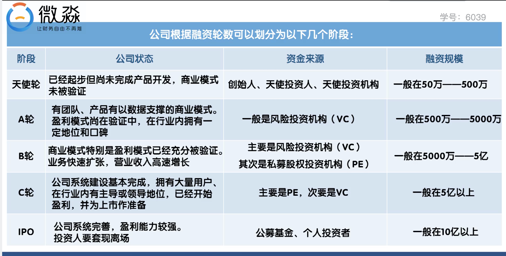
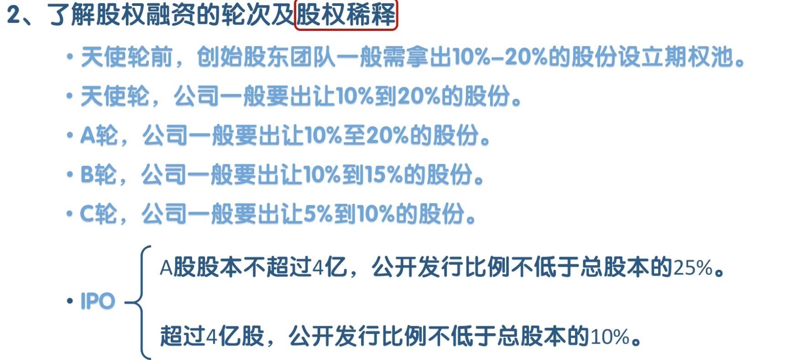
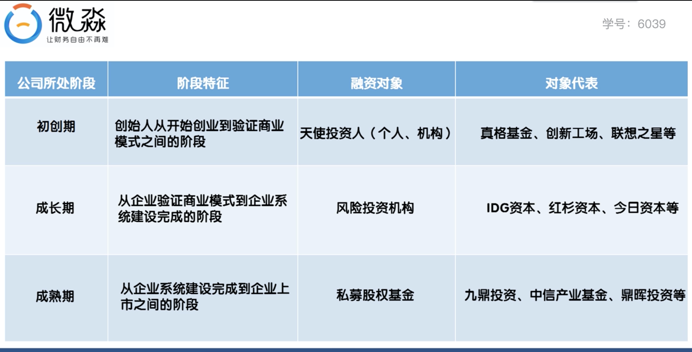

## 现金流
### 创业企业如何管理现金流
* 先算出自己企业每个月的固定成本
	* 固定成本就是什么事情都不做，也会发生的开支
	* 比如员工基本工资，房租，水电费等
	* 要保证企业账上的资金大于12个月的固定成本

### 怎么进行现金流管理

* 开源
	* 经营活动 为主
	* 融资活动 为辅
	* 但融资活动是创业期公司获得现金流的主要途径甚至是唯一途径
	* 创业期公司融资最主要的途径就是股权融资
* 节流---主要是降低固定成本
	* 办公场地费用
		* 选高档写字楼还是选普通写字楼
		* 创业公司在选择办公场地时，在能满足需求情况下，尽量选便宜的
		* 孵化器，联合办公场地都可以考虑
	* 员工工资
		* 高薪精兵
		* 低基本工资+ 高提成（中高层）
		* 低基本工资+股权等 （中高层）
* 如何通过股权融资获得现金流
	1. 优化股权结构
		* 股权结构在注册公司的时候就已经确定了
		* 优化股权结构最好的时机是在注册公司之前
		* 如果股权结构不合理，在融资前要先进行优化
		* 什么样的股权结构很难融到资
			* 平均的股权
		* 合理的股权结构是一股独大，核心创始人要大于67%
	2. 制定融资计划
		* 理解融资和股权转让的区别
			* 融资是公司通过增发新股获得外部投资者的资金，目的是做大公司
			* 获得的资金归公司所有而不归创始人所有
			* 融资一般对公司的发展有好处
			* 股权转让指创始人转让自己手里的股权，是套现行为
			* 股权转让的收益归属于个人而非公司
			* 股权转让一般对公司没有好处
		* 了解股权融资的轮次及股权稀释（一般3-5轮）
			* 
			* 股权稀释
				* 
		* 在融资过程中一定要确保创始人对公司的控制权
			* 最常用的方式是归集表决权	
			* 归集表决权的常用方式有
				* 签订授权委托书
				* 签订一致行动协议
		* 判断自己公司所处的阶段
			* 
		* 确定融资金额
			* 明确自己企业目前所处的阶段
			* 结合战略目标，确定未来12-18个月要做的事情
			* 要做成这件事情要多少钱
			* 资金缺口就是需要融资的最低金额
			* 融资金额也可以定为资金缺口的1.5~2倍 
			* 或者用公司人数 * 3万 * 18（未来18个月的开支）
		* 给自己公司估值
			* 种子公司一般在200-1000万 
			* 市盈率法
				* 根据公司所在行业来确定市盈率的倍数
				* 公司估值 = 净利润 * 市盈率
				* 不盈利的公司无法用该方法估值
			* 可比交易法
				* 看相似公司的估值，然后确定自己企业的估值
				* 此方法即适合没有盈利的公司，也适合已经盈利的公司
			* 确定股权出让比例
				* 根据需要的融资额和公司的估值确定股权出让比例
				* 初次融资，股权出让比例最好不高于15%，极限不要高于25%  
		根据公司所在行业来确定市盈率的倍数
	3. 写商业计划书
		* 注意要点
			* 从投资人角度写商业计划书----核心是商业模式
			* 内容要简单 -- PPT不超过10页，多用图，少用字
			* ppt要美
		* 怎么写商业计划书 
			* 第一页，用几句话配图说清楚2个问题：
				*  你的用户是谁
				*  你的用户存在什么问题
			* 第二页
				* 你用什么产品或服务解决用户的问题
			* 第三页
				* 你怎么推广你的产品
			* 第四页
				* 盈利模式
			* 第五页
				* 市场规模多大
			* 第六页
				* 核心竞争力是什么
			* 第七页
				* 行业中的地位（没有地位可不写）
			* 第八页
				* 未来12-18个月需要多少钱，钱怎么花
			* 第9页
				* 核心团队有什么优势（学历，履历，经历，做过什么事情）                
	4. 找投资人
		* 常用渠道
			* 熟人介绍 -- 成功率最高的途径
			* 财务顾问公司（FA）
				* 一般收取融资金额的3% ~ 5%
				* 通过财务顾问公司找投资人最好在a轮之后，金额在1000万以上
				* 知名FA
					* [以太资本](https://www.ethercap.com)
					* [华兴Alpha](https://alpha.huaxing.com)
					* [逐鹿x](https://www.zhulux.com)
					* [天使汇](http://angelcrunch.com)
					* 微链APP
			* ‘在行’app上约见投资人
			* 约见社交媒体上的投资人
				* 开个人公众号并经常更新文章的投资人，有可能约谈成功
				* 在知乎上写文章的投资人，也有可能约谈
				* 常发微博的投资人，有可能约谈
				* 脉脉上一般有相关关联人，可以让中间人做推荐
			* 找投资人是一个概率事件，需要多种渠道同时进行
			* 融资能否成功最主要的还是创始人及项目
				* 正确的人，强有力的执行
				* 创新的产品，已存的庞大需求      
	5. 筛选投资人
		* 筛选并不是直接拒绝，而是对投资人排序（可能会变卦）
		* 投资人的共同点：不会真的在乎你和你的公司，只是将来能赚很多钱退出
		* 注意点
			* 投资人口碑要好
			* 投资人对本行业见解深
			* 投资人提供的资源
			* 对投资人不反感 
	6. 签订投资意向书（投资条款清单）
		* 包括
			* 投资额
			* 占股比例
			* 优先清算权
			* 知情权
			* 反稀释权
			* 董事任命权
		* 投资意向书中的大部分条款不具有法律效力，但是排他性条款，保密条款有法律效力
		* 主要作用
			* 确认双方合作意愿，对核心条款建立共同认知
		* 只代表投资意向，不是正式融资协议，只有30%左右回变成正式融资协议
		* 投资机构为了独占好项目，投资意向书中大多有排他条款
			* 指在创业者与投资人约定的期限内，创业者不再与其他投资人进行融资谈判，以保证投资人完成尽职调查及签约、交割
			* 排他性条款是对创业者单方面的约束条款
			* 如果必须签，期限需要尽可能短，最好控制在1个月内，极限不要超过2个月
			* 尽可能的要求投资人给予一笔过桥贷款，这笔钱不退不还，尽职调查结束后转为投资款，额度可以住融资额的10%~40%之间，如果投资人不答应，尽量不要接搜排他性条款     
	7. 应对尽职调查（dd）
		* 包括
			* 人员调查，业务调查，市场调查，财务调查，法律调查等
		* 在尽职调查前，投资人会给创业者一份调查调查清单
		* 要求提供公司的历史变更，重大合同，财务报告，核心管理团队背景，客户名单等资料
		* 投资人会先要求创业者把发现的问题解决，然后他们再投资  

	8. 签订融资协议
		* 注意内容
			* 估值
				* 融资成功是最重要的
				* 在融资成功的前提下去谈高估值
				* 提高融资成功率最有效的方法就是敢于在估值上吃亏
			* 股权出让比例
				* 融资的股权出让比例最好低于20%
				* 具体情况具体定，以融资成功为基本前提
			* 优先清算权
				* 指公司在破产清算或被收购时，投资人首先从可分配的总额中先分配投资款的x倍，剩余部分全体股东按各自持股比例再分配
				* 几乎所有的投资人都会要求
				* 竟可能把x压低
			* 优先分红权
				* 指投资人作为优先股东有优先于普通股东分配投资额一定比例股息的权利，然后与其他股东分配剩余股息（可以接受）
			* 增资权
				* 指投资人完成本轮投资后，可以在公司下一轮或一定期限内以事先约定好的价格追加投资，购买公司一定比例的股权（本质是期权，对创业者没有好处，对投资人有好处，尽可能拒绝）
			* 赎回权
				* 指投资人有权要求创始人或公司全部赎回或部分赎回投资人所持有的股份
				* 赎回的价格一般为投资金额上每年x%的固定收益率
				* 绝大部分投资人都会要求赎回权，尽量拒绝
				* 必须接受只能以公司的身份接受，而不能以个人的身份接受
				* 不然自己后期可能会因被迫赎回而破产
			* 强制出售权
				* 投资人有权要求主动退出并强制公司创始人和其他股东一起向第三方转让股份
				* 尽可能拒绝
				* 必须接受需要加上对自己有利的限制性条件
			* 董事会席位
				* 派董事入驻董事会是投资人控制或影响公司决策的主要手段
				* 有限责任公司的董事会成员为3-13人，最好不要超过5人
				* 股份有限公司的董事成员为5-19人，最好不要超过7人
				* 可以让投资人派董事进入董事会，但要确保创始人团队控制一半以上的席位
				* 对于持股比例小于10%的投资人，尽量不要让其进入董事会
			* 对赌条款
				* 指创始人在约定期限内没有完成约定目标，则必须通过现金，股份，股份回购等形式对投资人进行补偿
				* 除非公司融不到钱马上死了，否则不要接受任何形式的对赌条款
			* 一票否决权
				* 可以接受，但是要限制范围
				* 范围限定在对投资人利益有重大损害的重大事项上                   
	9. 收到融资款     