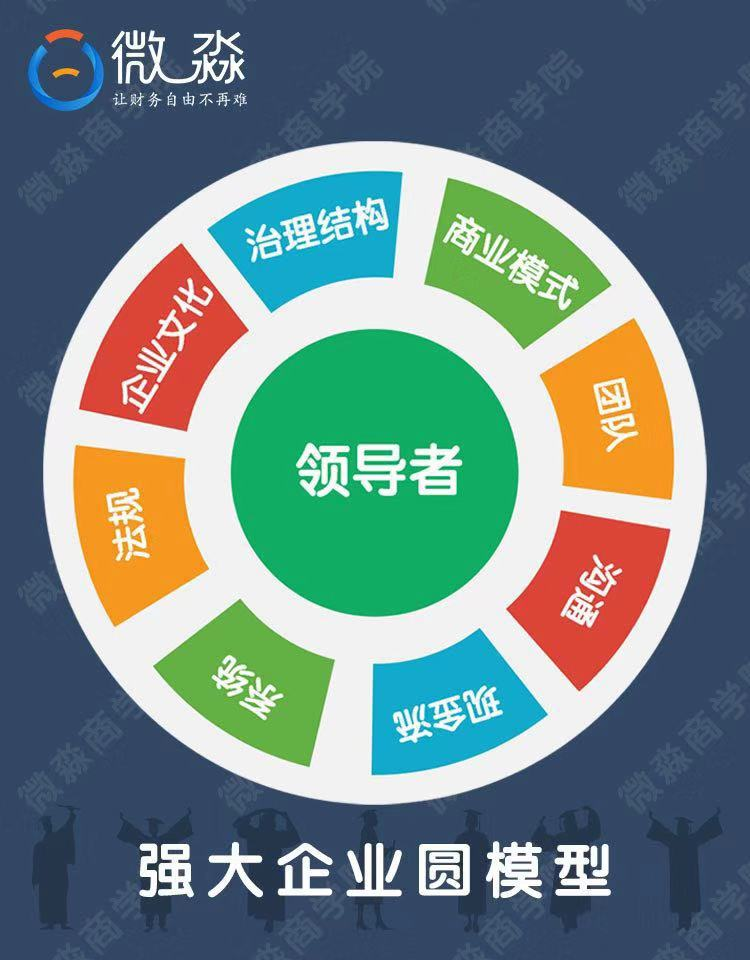

# 理财思维

* 资产的核心是现金流
	* 生钱资产：能产生持续的现金流
	* 耗钱资产：带来净现金流出
	* 其他资产：产生的净现金流为0

* 资产配比：生钱资产占总资产的80%，好支出占总支出80%

* 复利的重要性，提高复利的利率

* 投资理财工具：
	* 无风险的理财工具主要有5个，3%-5%：【国债逆回购】【货币基金】
		* 【国债逆回购】20%，本质就是国债抵押借款：市场资金供应情况，资金紧缺，收益率就会很高，买进到期之后本金和利息在到期日当天到你账户上
		* 【货币基金】：每年可以获得4%左右的无风险收益（无手续费）
		* 闲钱管理：【货币基金】+【国债逆回购】

	* 低风险：低风险中等收益，年化收益率一般6%—15%:【分级基金A】、【可转债】、【债券基金】、【股票指数基金】
		* 【可转债】：转换成股票的债券（在100元以下买进高信用等级的可转债没有风险）（一般90元以下买进，年化收益率可达到10%-20%）
		* 【股票指数基金】复制股票指数的股票基金（10%—15%）
	* 低风险高收益，年化收益率一般在15%—30%之间：股票（持续分红的股票，10%以上）、REITs、房地产
		* 【股票】就是股份公司发行的所有权凭证，持有股票的人享有对公司的很多权利。比如分红权、投票权、知情权等。
		* 【REITs】房地产信托基金：本质就是投资房地产（15%以上）
	* 中风险的理财工具:【黄金】，【银行理财（不保本）】，【其他类型股票】，【生钱资产类型企业】
	* 高风险：P2P公司【私募基金】【比特币】【收藏品】【耗钱资产类型的房地产】【期货】

	* 分析工具：雪球网、i问财网，东方财富通APP

* 财报
	* 应付 公司应该付给上下游，但是还没付出的款项
	* 预收 公司提前拿到的款项
	* 应付 + 预收 表示公司无偿占用上下游公司的资金
	* 应收 公司应该获得的款项
	* 预付 公司提前支付的款项
	* 应收 + 预防 表示公司被上下游公司占用的资源
	* （应付 + 预收） - （应收 + 预付）越大，表示公司的竞争力越大
	* 负债合计 / 资产合计 = 资产负债率表示公司偿债风险
		* 资产负债率 > 70% 偿债风险比较大
		* 资产负债率 < 40% 偿债风险比较小

* 企业圆模型

	* 